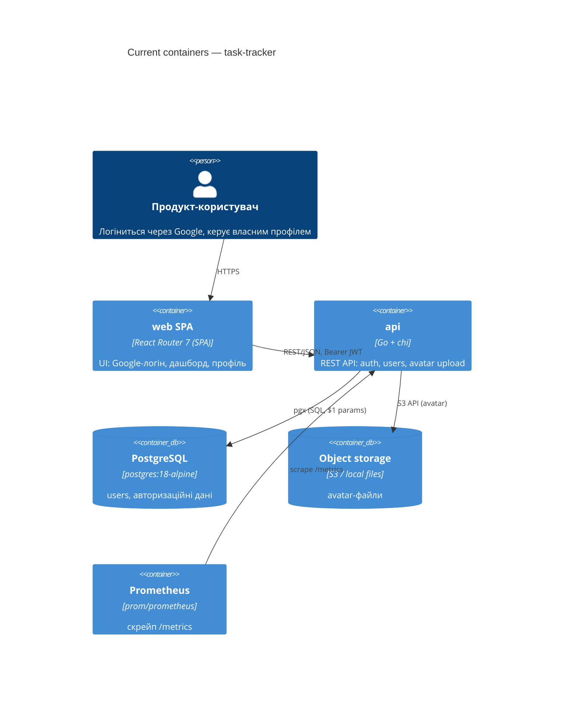

# Architecture map — task-tracker

> The **current** architecture (what exists today), produced by `survey` and read by
> specify / design / data-model / implement. Refresh with `survey` when the repo drifts past
> `reflects_commit`. This is generated; a hand-maintained `docs/architecture.md`, if present, is
> authoritative and reconciled below — not replaced.

## Stack

- Language / runtime: Go 1.25.0 (`api/go.mod:3`); TypeScript 5.9.2 on Node (`web/package.json:68`)
- Frameworks (backend): chi/v5 (routing, `api/go.mod:10`) · pgx/v5 + pgxpool (`api/go.mod:17`) · golang-jwt/v5 (`api/go.mod:13`) · golang-migrate/v4 (`api/go.mod:14`) · google/uuid v7 (`api/go.mod:15`) · prometheus/client_golang (`api/go.mod:18`) · testify + testcontainers-go (`api/go.mod:19-21`) · AWS SDK v2 for S3 (`api/go.mod:6-8`)
- Frameworks (frontend): React 19.2.4 (`web/package.json:40`) · React Router 7.12.0 SPA mode (`web/package.json:44`, `web/CLAUDE.md:7`) · Vite 7.1.7 (`web/package.json:69`) · Tailwind CSS 4.1.13 (`web/package.json:66`) · shadcn/ui + CVA · vitest 3.2.4 (`web/package.json:71`) · Playwright 1.58.2 (`web/package.json:51`)
- Build / test / lint: `make check` (root) → `make -C api check` (vet+lint+test) + `make -C api test-integration` (testcontainers, needs Docker) + web `npm run typecheck && npm test`; `make -C api lint` no-ops locally without golangci-lint installed but always runs in CI

## C4 — system as it is

## Module inventory

| Module | Path | Layers | Wired at | Responsibility |
|---|---|---|---|---|
| auth | `api/internal/modules/auth` | domain/app/ports/infra | `api/cmd/api/main.go:50-57` (`auth.New`) | Google OAuth flow, JWT issuance/validation |
| user | `api/internal/modules/user` | domain/app/ports/infra | `api/cmd/api/main.go:85` (`user.New(db, avatarStorage)`) | Профіль користувача, аватар, список/CRUD |
| server | `api/internal/server` | — (composition, не domain-модуль) | `api/cmd/api/main.go:83-87` (`server.New`) | chi router, middleware stack, `RouteRegistrar`/`ProtectedRouteRegistrar` реєстрація, `/metrics`,`/livez`,`/readyz` |
| auth-by-google (frontend) | `web/src/features/auth-by-google` | api/model/ui (FSD feature slice) | `web/src/pages/home/ui/HomePage.tsx`, `web/src/app/layouts/ProtectedLayout.tsx` | Google-логін кнопка + auth-стан на клієнті |
| edit-profile (frontend) | `web/src/features/edit-profile` | api/model/ui (FSD feature slice) | `web/src/pages/profile/ui/ProfilePage.tsx` | Форма редагування профілю |

## Conventions (cited — the rules a new feature must match)

- **Module wiring / registration:** ручний constructor injection — кожен модуль має top-level `<domain>.go` з `New(...) *ports.Handler`, переданим у `server.New(db, corsOrigins, authMW, opts...)` як variadic opt — `api/cmd/api/main.go:83-87`, `api/internal/modules/user/user.go:11-15`
- **Route registration:** модулі реалізують `RouteRegistrar`/`ProtectedRouteRegistrar` — `api/internal/server/server.go:20-28`
- **Error handling:** domain sentinel errors (`errors.New(...)`) → per-module `ports/errors.go` `mapError` таблиця (`errors.Is` matching) → `apperr.Error{Code, Message, StatusCode}` → HTTP — `api/internal/modules/user/domain/domain.go:16-20`, `api/internal/modules/user/ports/errors.go:11-28`, `api/internal/platform/apperr/apperr.go:3-9`
- **IDs:** UUID v7, app-генеровані через `google/uuid`, НЕ DB `SERIAL`/`gen_random_uuid()` — `api/internal/modules/user/domain/domain.go:23` (полу через `User.ID uuid.UUID`), схема `api/migrations/000002_create_users.up.sql:2`
- **Persistence / DB access:** pgx/v5 з параметризованими `$1`-запитами, repo pattern — кожен модуль має `infra/*_repo.go`, що реалізує `ports`-інтерфейс — `api/internal/modules/user/infra/infra.go`
- **Migrations:** `<NNNNNN>_<verb>_<entity>.up.sql`/`.down.sql`, sequential 6-digit numbering, поточний head `000005` — `api/migrations/000002_create_users.up.sql` (конвенція детальніше в `.claude/rules/migrations.md`, але його приклади "head 000019"/`mentorship`-модуль застарілі й не відповідають цьому репо)
- **Tests:** unit — testify `assert`/`require`, package `<x>_test`; integration — `//go:build integration` + testcontainers `dbtest` + seeded admin UUID — `api/internal/modules/user/ports/handler_integration_test.go:1,33-46`; frontend — vitest + Testing Library, `*.test.tsx` поруч із кодом
- **Inter-module communication:** прямі виклики всередині process, без message queue; auth-межа — `authmw.Middleware(tokenValidator)` в middleware stack, claims у `r.Context()` — `api/cmd/api/main.go:59-60`
- **Logging:** `log/slog` JSON handler, `slog.SetDefault` у `main.go`, structured key-value — `api/internal/platform/logging/logging.go:9-13`
- **UI / styling (if a frontend exists):** shadcn/ui-примітиви на Tailwind 4 + CVA, `cn()` (clsx+tailwind-merge) для умовних класів — `web/src/shared/ui/button.tsx:7-22`, `web/src/shared/lib/utils.ts` (детально нижче в §Frontend / UI foundation)

## Datastores

| Store | Engine | Accessed via | Notes |
|---|---|---|---|
| Primary DB | PostgreSQL 18 (`postgres:18-alpine`, `docker-compose.yml`) | pgx/v5 + pgxpool, repo pattern (`internal/platform/database`) | Схема через golang-migrate; UUID v7 PK app-side |
| Object storage | S3 (`api/internal/platform/storage`, S3-config) або local filesystem fallback | `storage.ObjectStorage` interface, `api/cmd/api/main.go:62-81` | Аватари; local-режим пише в `/var/www/files/avatars` |
| Client-side tokens | localStorage (браузер) | `web/src/shared/api/client.ts` (access/refresh token) | Не серверне сховище; auto-refresh на 401 |

## Frontend / UI foundation

- **Component library / design system:** in-repo `shared/ui/` на базі shadcn/ui — `web/src/shared/ui/` (button, avatar, badge, calendar, card, dialog, dropdown, input, label, popover, sheet, sonner (toast), tiptap-editor, stepper, time-picker тощо)
- **Design tokens:** Tailwind 4 `@theme` блок в CSS, OKLCH-кольори (light+dark), базовий радіус `0.75rem`, шрифт Geist Variable — `web/src/app/styles/global.css` (токени `:66-132`, `@import`/шрифт `:1,10-11`)
- **Styling approach:** Tailwind 4 utility-класи + CVA (class-variance-authority) для варіантів компонентів; жодних CSS-модулів чи styled-components — `web/src/shared/ui/button.tsx:7-22`
- **Shared primitives:** Button (CVA variants: default/destructive/outline/secondary/ghost/link; sizes xs→lg + icon-варіанти) — `web/src/shared/ui/button.tsx:7-35`; плюс Card, Dialog, Sheet, Dropdown, Popover, Input, Label, Avatar, Badge, Sonner (toast), EmptyState, UserAvatar, Wordmark
- **State / data-fetching:** typed fetch client `web/src/shared/api/client.ts:9-21` (`ApiClientError`, auto-refresh на 401); auth-стан через React context (`app/providers/auth`) + React Router loader/state; жодного окремого data-fetching lib (react-query тощо) не знайдено
- **Closest UI precedent:** захищений layout з responsive sidebar/mobile-sheet — `web/src/app/layouts/ProtectedLayout.tsx:1-51`; проста сторінка з умовним CTA — `web/src/pages/home/ui/HomePage.tsx:1-26`

## Where things live / closest precedents

- Новий backend-модуль → `api/internal/modules/<domain>/{domain,app,ports,infra}` + top-level `<domain>.go` з `New(...)`, за зразком `api/internal/modules/user/` (`api/internal/modules/user/user.go:11-15`); детальний скелет — скіл `go-project-layout`.
- Нова frontend-фіча → `web/src/features/<feature>/{api,model,ui}`, композиція в `pages/`, за зразком `web/src/features/auth-by-google/` (`web/src/pages/home/ui/HomePage.tsx`).
- Новий екран/UI-компонент → компонується з наявної дизайн-системи (§Frontend), за зразком `ProtectedLayout.tsx` (responsive layout) або `HomePage.tsx` (проста сторінка з CTA).

## Constraints & known tech-debt

- Продуктових фіч у репо ще немає (fresh scaffold з `base-tpl`) — `auth`/`user` це лише каркас автентифікації й профілю, не product-домен. Продукт, який тут має з'явитись — борда задач без акаунтів (`docs/idea-brief.md` §5 Out of scope прямо виключає акаунти) — це створює напругу з наявним Google OAuth каркасом: нова фіча board або обходить authMW повністю (публічний read-only доступ), або auth-модуль лишається невикористаним мертвим кодом у продукті.
- `.claude/rules/migrations.md` містить приклади з іншого (попереднього) проєкту (`mentorship`-модуль, "head 000019") — сама конвенція (naming, zero-downtime patterns, forbidden constructs) чинна, але конкретні числа/назви в прикладах не відповідають цьому репо. Не орієнтуватись на них буквально.
- `golangci-lint` не встановлено локально — `make -C api lint` мовчки скіпається поза CI; перед комітом покладатись на CI-запуск або встановити лінтер локально.
- Object storage за замовчуванням — local filesystem fallback (`/var/www/files/avatars`), не персистентний поза контейнером; продакшн-профіль потребує реальних S3-креденшлів.

## Reconciliation with the authored architecture doc

Авторський архітектурний документ (`docs/architecture.md`/`ARCHITECTURE.md`) відсутній. Наявні `CLAUDE.md` (корінь), `api/CLAUDE.md`, `web/CLAUDE.md` — авторитетні тонкі чартери; звірено при скануванні, розбіжностей не знайдено (версії Go/Node, layout модулів, FSD-шари, `.claude/rules/go-*.md` як джерело конвенцій — усе співпадає). Ця карта — поточне джерело істини для `specify`/`design`/`data-model`/`implement`.
