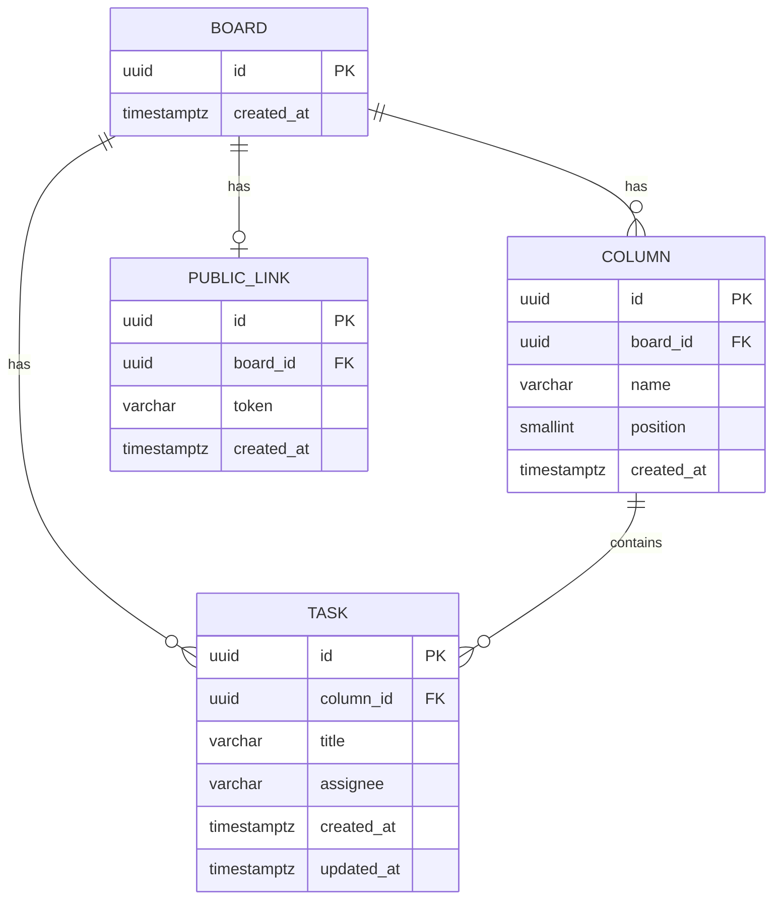

# Data model — board

## ER diagram

## Entities

### `boards`

| Column | Type | Constraints | Notes |
|---|---|---|---|
| `id` | UUID | PK, app-generated (UUID v7) | one bootstrap-seeded row — product always has exactly one board (CONTEXT.md invariant) |
| `created_at` | TIMESTAMPTZ | NOT NULL DEFAULT now() | |

**Aggregate root:** root — `boards` is the aggregate root; `columns`, `tasks` (via `columns`), and `public_links` all belong to it.
**Access patterns:** app boots against the single seeded row — no query beyond a fixed-ID lookup or `SELECT ... LIMIT 1`; no index needed beyond the PK.
**Constraints:** none beyond PK.

### `columns`

| Column | Type | Constraints | Notes |
|---|---|---|---|
| `id` | UUID | PK, app-generated (UUID v7) | |
| `board_id` | UUID | NOT NULL, FK → `boards(id)` | indexed below |
| `name` | VARCHAR(100) | NOT NULL | fixed, seeded set (ADR-0004) — "To Do" / "In Progress" / "Done"; no CRUD |
| `position` | SMALLINT | NOT NULL | display order; 0 = leftmost (AC-01 "найлівіша column") |
| `created_at` | TIMESTAMPTZ | NOT NULL DEFAULT now() | |

**Aggregate root:** `boards` (via `board_id`).
**Access patterns:** render board state → columns ordered left-to-right for a board (SCR-01, AC-01) → index `idx_columns_board_id_position` on `(board_id, position)`.
**Constraints:** UNIQUE `(board_id, position)` — one column per display slot; FK → `boards(id)`.

### `tasks`

| Column | Type | Constraints | Notes |
|---|---|---|---|
| `id` | UUID | PK, app-generated (UUID v7) | |
| `column_id` | UUID | NOT NULL, FK → `columns(id)` | task's status *is* its column (CONTEXT.md: "окремого поля status у схемі даних немає") — no separate status column, ever |
| `title` | VARCHAR(200) | NOT NULL | non-empty enforced at app layer (AC-02) |
| `assignee` | VARCHAR(200) | NULL | free-text name, not an account reference (CONTEXT.md glossary) |
| `created_at` | TIMESTAMPTZ | NOT NULL DEFAULT now() | |
| `updated_at` | TIMESTAMPTZ | NOT NULL DEFAULT now() | |

**Aggregate root:** `boards` (via `columns.board_id`); `column_id` is the direct FK.
**Access patterns:** render board state → tasks per column (SCR-01, AC-01/AC-04) → index `idx_tasks_column_id` on `(column_id)`; move (AC-04/AC-05b) is a single-row `UPDATE tasks SET column_id = $1 WHERE id = $2` — last-write-wins by design (spec §6 NFR), no version/lock column.
**Constraints:** FK → `columns(id)`.

### `public_links`

| Column | Type | Constraints | Notes |
|---|---|---|---|
| `id` | UUID | PK, app-generated (UUID v7) | |
| `board_id` | UUID | NOT NULL, UNIQUE, FK → `boards(id)` | at most one active link per board (AC-07 checks "ще немає активного лінка") |
| `token` | VARCHAR(64) | NOT NULL, UNIQUE | opaque, unpredictable (ADR-0003) — app-generated, not a signed/derived value |
| `created_at` | TIMESTAMPTZ | NOT NULL DEFAULT now() | |

**Aggregate root:** `boards` (via `board_id`).
**Access patterns:** viewer opens `/b/{token}` (AC-09/AC-11) → lookup `WHERE token = $1` → UNIQUE constraint on `token` already indexes it; revoke (AC-08) → `DELETE FROM public_links WHERE board_id = $1` (ADR-0003: revoke is one `DELETE`, hard-delete — matches the repo's existing `Delete(ctx, id)` hard-delete pattern in `user` module, no `revoked_at`/soft-delete column).
**Constraints:** UNIQUE `(board_id)`; UNIQUE `(token)`; FK → `boards(id)`.

## Indexes

| Index | Columns | Query it serves |
|---|---|---|
| `idx_columns_board_id_position` | `columns(board_id, position)` | Render board state ordered left-to-right (SCR-01; AC-01 "найлівіша column") |
| `idx_tasks_column_id` | `tasks(column_id)` | Render tasks per column (SCR-01) and support the move `UPDATE` (AC-04, AC-05b) |
| *(implicit)* `public_links_board_id_key` | `public_links(board_id)` | UNIQUE constraint — enforces "at most one active link" (AC-07) and doubles as the FK index |
| *(implicit)* `public_links_token_key` | `public_links(token)` | UNIQUE constraint — viewer public-link lookup by token (AC-09, AC-11) |

## Test fixtures

<!-- repo has no factory/builder library (api/internal/modules/user/ports/handler_integration_test.go builds
structs and rows inline) — board follows the same pattern, no new fixture library introduced. -->

- No dedicated factory functions — repo convention (see `user` module integration tests) is to insert rows /
  build domain structs inline per test. `board` unit and integration tests follow the same pattern: a helper
  `seedBoard(t, db)` inserting one `boards` row (mirroring `dbtest.StartPostgres` + inline literals already
  used in `api/internal/modules/user/ports/handler_integration_test.go`) is the only shared scaffolding
  expected — not a fixture library.
- The three `columns` rows and the single `boards` row are **not** test fixtures — they come from the staged
  seed migrations (`02_seed_board`, `04_seed_columns`) applied by `dbtest` like any other migration.
