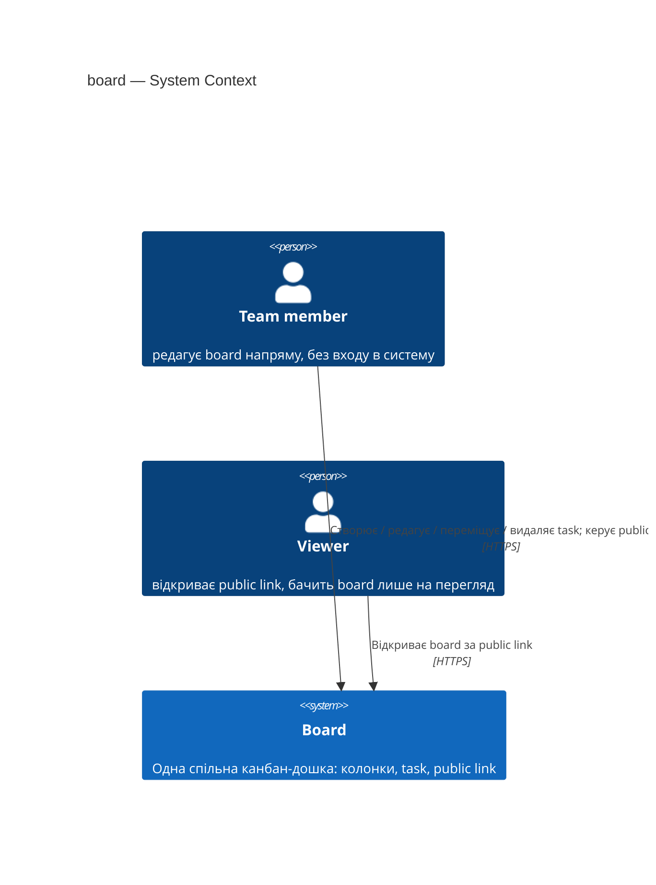
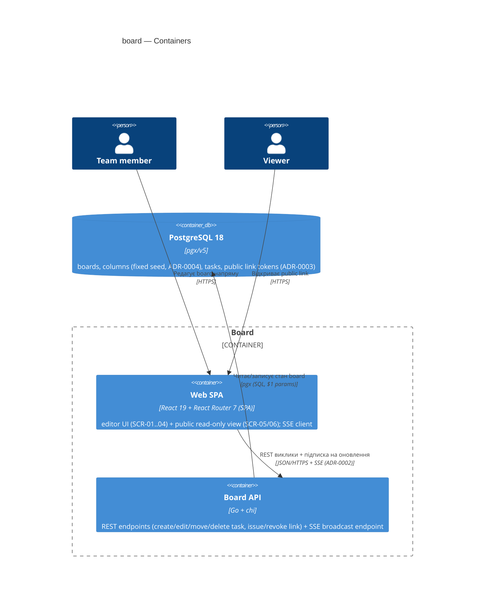
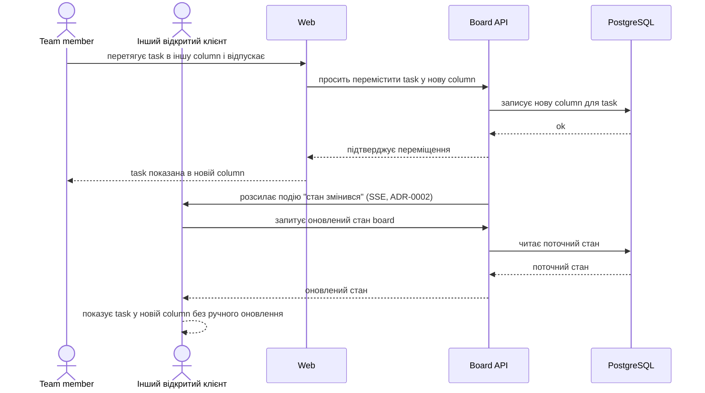
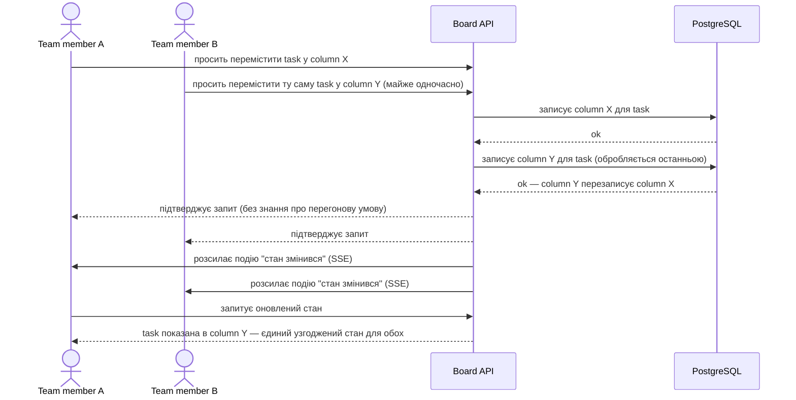
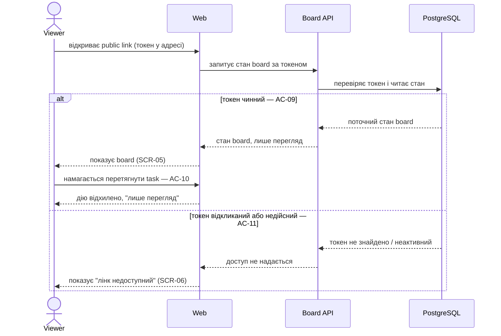

# Software Architecture Document — board

<!-- 12 Arc42 sections. Empty section → <!-- N/A: <one-line reason> -->. -->
<!-- C4 Context (L1) lives inline in §3. C4 Container (L2) lives inline in §5. -->
<!-- Numbers in §10 come VERBATIM from spec.md §6 NFR — no inventing, no rounding. -->

## 1. Introduction and goals

**Intent.** Дати малій команді (3–7 людей) спільний, завжди актуальний канбан-стан задач без реєстрації чи облікових записів, і дати їм один лінк, яким можна показати реальний прогрес глядачам поза командою — виключно на перегляд, без права редагування. Продукт — рівно одна board, яку team member редагує напряму (створює, редагує, переміщує перетягуванням, видаляє task), і яку будь-хто може відкрити через public link (spec §2 Goals).

**Top-3 quality goals (1-liners; full scenarios in §10):**

1. **Availability з телефонів у залі воркшопу** — найближчий воркшоп є фіксованим дедлайном і живою перевіркою продукту: public link має відкриватись зі смартфонів глядачів надійно, а не лише з ноутбука команди (spec §1 Context, §7 KPIs).
2. **Узгодженість статусу task під конкурентним перетягуванням** — task завжди належить рівно одній column, навіть коли двоє team member одночасно перетягують ту саму task (AC-05b, domain invariant з spec §6).
3. **Відповідність (responsiveness) дій редагування** — щоб інструмент читався як «реально працює», а не як макет слайда: p95 запису ≤300ms, p95 завантаження board ≤500ms (spec §6 NFR).

**Stakeholders.**

| Role | Interest | Sign-off owner? |
|---|---|---|
| team member (CONTEXT glossary) | Редагує board напряму: створює/редагує/переміщує/видаляє task, керує public link | No |
| viewer (CONTEXT glossary) | Відкриває public link, бачить поточний стан board лише на перегляд | No |
| Tech Lead | SAD approval | Yes |
| Security Lead | Security review публічного неавтентифікованого доступу (spec §6.1) | Yes |

**Decision override:** real-time board delivery через Server-Sent Events, а не fetch-on-load — rationale: idea-brief §7/§14 явно розглянув і «запаркував» Approach B «жива трансляція борди» через розмір L і крихкість постійних з'єднань у залі воркшопу з нестабільним Wi-Fi. Design (§4, blast-radius gate) явно перевідкрив це рішення, і користувач обрав live push замість рекомендованого fetch-on-load, звузивши реалізацію до односпрямованого SSE (не повний WebSocket) — деталі й наслідки → ADR-0002.

## 2. Constraints

**Technical.**
- Backend: Go 1.25.0, chi/v5 (routing), pgx/v5 + pgxpool (Postgres driver), golang-migrate/v4, google/uuid v7, prometheus/client_golang (`docs/architecture-map.md` §Stack).
- Frontend: React 19.2.4 + React Router 7.12.0 **SPA mode** (`ssr: false` — repo-wide, not per-feature), Vite 7.1.7, Tailwind 4.1.13 + shadcn/ui + CVA.
- Datastore: PostgreSQL 18 (`postgres:18-alpine`) — board's only datastore, accessed via pgx/v5 repo pattern. Репо також має S3/local-filesystem object storage для аватарів user-модуля (`architecture-map.md` §Datastores) — board цим не користується.
- Architecture convention: modular monolith, manual constructor-injection wiring (`api/cmd/api/main.go`); each module owns `domain/app/ports/infra` + a top-level `New(...)` (`CLAUDE.md` §Architecture, `.claude/rules/go-*.md`).

**Organisational.**
- Effort budget: ~3 person-weeks (idea-brief §11 RICE Effort signal, Approach C).
- Deadline: hard — the nearest workshop is the trigger event (spec §1 Context), but no calendar date is fixed in any upstream artifact (idea-brief, spec) — **TBD by PM**, tracked as a §11 risk row.
- Team composition: solo author driving both product and implementation (idea-brief §3 Users, §12 Feasibility «Skills» — full-cycle expertise already in hand).

**Conventions.**
- `.claude/rules/go-*.md` (naming, error handling, concurrency, context, structs/interfaces, security, observability) + `.claude/rules/migrations.md` (paired `.up.sql`/`.down.sql`, sequential 6-digit numbering, current head `000005`).
- IDs: app-generated UUIDv7 via `google/uuid`, never DB `SERIAL`/`gen_random_uuid()`.
- Error handling: domain sentinel errors → per-module `ports/errors.go` `mapError` → `apperr.Error` → `httputil.WriteError`.
- Frontend: Feature-Sliced Design (`app/ → pages/ → widgets/ → features/ → entities/ → shared/`), typed API client (`web/src/shared/api/client.ts`), UI composed from `shared/ui` shadcn primitives — never hand-edited.

**Regulatory / external.**
- No formal compliance regime applies (internal team tool, no accounts, no regulated data categories) — spec §6.1 classifies task titles/assignee names as **internal** data, not personal-data-regulated beyond the free-text assignee name.
- Security review is **required** before ship — spec §6.1 names the new unauthenticated public read access as the project's primary risk (idea-brief §10 devil's-advocate risk: a leaked/indexed link exposes team data indefinitely without revocation).

## 3. Context and scope

Board — рівно одна спільна канбан-дошка команди. team member редагує її напряму, без входу в систему; будь-хто, хто отримав public link від team member, відкриває board виключно на перегляд, теж без входу в систему.

<!-- brownfield: `docs/architecture-map.md` (reflects cfa5e7f) — fresh full-stack scaffold, auth/user — це лише каркас автентифікації й профілю (Google OAuth + JWT), не продуктовий домен; board — перший продуктовий модуль і свідомо не використовує наявний auth (`architecture-map.md` §Constraints & known tech-debt). -->

**External systems (in / out):**

| Actor or system | Type | Interaction |
|---|---|---|
| team member | Person | Створює/редагує/переміщує/видаляє task; отримує/відкликає public link |
| viewer | Person | Відкриває public link, бачить поточний стан board лише на перегляд |
| External systems | — | **None** (deliberate) — board не викликає жодного зовнішнього сервісу (ні наявний Google OAuth, ні сповіщення, ні сторонні API); увесь стан централізований в одному Postgres |

**C4 Context (L1):**



Board показаний як один чорний ящик: team member взаємодіє з ним напряму (повний доступ до редагування), viewer — виключно через public link (лише перегляд). Зовнішніх систем немає — свідоме рішення: наявний Google OAuth-каркас репо (`architecture-map.md`) залишається невикористаним цією фічею, бо продукт explicitly не має акаунтів (spec §3 Non-goals).

## 4. Solution strategy

**Top strategic choices (the seeds for ADRs):**

1. **Target surface: backend API + web SPA** — board — це Go REST API (`backend-service`) плюс React SPA (`web-frontend`), єдине джерело істини — Postgres через API; і team member, і viewer завжди бачать той самий стан (ux-flows.md — 6 екранів). → **ADR-0001**.
2. **Push board-стану через Server-Sent Events (SSE), не fetch-on-load** — щойно team member змінює task, кожен відкритий клієнт (інший team member або viewer на public link) отримує оновлення миттєво, без ручного перезавантаження — «жива» демонстрація на воркшопі. Конкретний механізм — SSE (`EventSource`), не повний WebSocket: канал односпрямований (сервер → клієнт; записи й далі йдуть звичайним REST POST/PUT/DELETE), а `EventSource` має вбудований auto-reconnect — менше рухомих частин, ніж ручна reconnect-логіка WebSocket. → **ADR-0002**.
3. **Public link — непередбачуваний токен, збережений у Postgres** — жодної криптографії з підписом; відкликання = один `DELETE`/`UPDATE` рядка, миттєво і без побічних ефектів (AC-11). → **ADR-0003**.
4. **Column — фіксований, заданий заздалегідь набір (seed-міграція), без CRUD** — жодна user story spec не вимагає керування колонками; мінімальна схема даних відповідає принципу «без роздування скоупу» (idea-brief §13). → **ADR-0004**.

Each tactical decision in later sections should trace to one of these seeds. Tactical decisions that *contradict* a strategic choice are red flags — surface them in §11.

## 5. Building block view

Backend — layered модуль за наявною конвенцією репо (`domain/app/ports/infra`, ручний constructor-injection, ADR-0001): новий модуль `board` без наявних module-to-module залежностей (auth/user не зачіпаються, ADR-0001 контекст). Frontend — FSD-фіча `board` (api/model/ui) плюс окрема сторінка для публічного read-only перегляду, обидві композуються з наявних shadcn/ui-примітивів (`architecture-map.md` §Frontend), без нового styling-підходу.

**Internal decomposition:**

```
api/internal/modules/board/
├── domain/       <Board, Column (fixed set, ADR-0004), Task entities + sentinel errors>
├── app/          <BoardService: CreateTask/EditTask/MoveTask/DeleteTask/IssueLink/RevokeLink/GetState>
├── infra/        <Postgres repo (pgx) + in-process SSE hub (ADR-0002, broadcast to subscribed connections)>
├── ports/        <HTTP handlers (team-editor routes, public-viewer routes by token, SSE endpoint), DTOs, mapError>
└── board.go      <New(...) *ports.Handler, wired in api/cmd/api/main.go — no authMW (ADR-0001 context, no accounts)>

web/src/
├── pages/board/            <editor view — composes features/board, features/public-link (SCR-01, SCR-04)>
├── pages/board-public/     <public read-only view by link token (SCR-05, SCR-06)>
├── features/board/
│   ├── api/                <typed client calls + SSE subscription (ADR-0002)>
│   ├── model/               <drag-and-drop state, optimistic UI for create/edit/move/delete>
│   └── ui/                  <task card, column, quick-add (SCR-02), edit modal (SCR-03)>
└── features/public-link/
    ├── api/                <issue/revoke link calls>
    ├── model/               <link state — active / none>
    └── ui/                  <SCR-04 панель: показати лінк, кнопки отримати/відкликати>
```

**C4 Container (L2):**



## 6. Runtime view

**Critical flow 1: Team member перетягує task, зміна доходить до всіх живих клієнтів (AC-04, ADR-0002)**



**Critical flow 2: Конкурентне перетягування тієї самої task двома team member (AC-05b, domain invariant)**



**Critical flow 3: Viewer відкриває public link; лінк відкликано (AC-09, AC-10, AC-11)**



**Відкликання закриває вже відкриті SSE-з'єднання, не лише блокує нові.** Якщо viewer у момент відкликання вже тримає живе SSE-з'єднання (Flow 1 — API розсилає події всім живим клієнтам), team member, що відкликає лінк, мусить негайно розірвати саме це з'єднання з боку API — інакше AC-08/AC-11 порушуються для вже підключеного viewer'а, хоча нові спроби відкриття коректно відхиляються. API веде реєстр «токен → активні SSE-з'єднання» і закриває їх синхронно з операцією відкликання.

## 7. Deployment view

**Це закриває spec §8 Open Question 1** («де хоститься board, щоб public link був стабільно доступний з телефонів глядачів у залі воркшопу»): board не отримує нової інфраструктури — вона розгортається в тому самому одноінстансному VPS-стеку, що вже є в репо (`deploy/docker-compose.prod.yml`, `deploy/Caddyfile`, `.github/workflows/deploy.yml`): один контейнер `api` (тепер несе й board-модуль), один `web` (SPA), один `postgres`, за Caddy з автоматичним TLS на публічному домені `${DOMAIN}`. Публічний домен з HTTPS — і є відповідь на «доступність з телефонів у залі»: жодна мережа воркшопу не потрібна, глядачі йдуть у звичайний інтернет.

**Специфічна вимога ADR-0002 (SSE):** Caddy reverse-proxy для `/api/*` не повинен буферизувати SSE-потік (`encode` + типове буферизоване проксіювання зіпсують push-доставку) — для SSE-ендпоінта board потрібен `flush_interval -1` (негайний flush) у `reverse_proxy`-директиві `deploy/Caddyfile`; це конфігураційна зміна existing Caddyfile, не нова інфраструктура.

**Monitoring:**
- Метрики: наявний `/metrics` (Prometheus) розширюється board-специфічними лічильниками — кількість активних SSE-з'єднань, кількість відправлених broadcast-подій, латентність запису task (для перевірки NFR p95 ≤300ms).
- Алерти: не вводяться нові окремо для board у v1 — використовується наявний Grafana-дашборд (`deploy/grafana/dashboards/`); нова панель для SSE-з'єднань — рекомендація для `implement`, не блокер design.
- Tracing: не вводиться (репо не використовує розподілену трасировку сьогодні — поза скоупом цієї фічі).

**Scaling thresholds:**
- Один інстанс `api` комфортно тримає ціль NFR ≥20 req/s (spec §6) і очікуваний масштаб — команда 3–7 людей + ~30 глядачів воркшопу одночасно (idea-brief §11 Reach).
- Понад це (друга репліка `api`) SSE-розсилка (ADR-0002) перестає працювати коректно без спільного pub/sub — зафіксовано як прийнятний технічний борг v1 у §11, не поточна вимога.

## 8. Crosscutting concepts

| Concept | Convention | Where defined |
|---|---|---|
| Logging | Успадковано: `log/slog` JSON handler, structured key-value | `architecture-map.md` §Conventions |
| Authorization | **Не** через наявний `authMW` (Google OAuth) — board і viewer, і team member обслуговує без входу в систему. Дві можливості розрізняються шляхом/токеном, не роллю: team-editor route (`RouteRegistrar`, публічний за визначенням — знання базового URL = право редагувати) проти public-viewer route з opaque токеном у шляху (ADR-0003, перевірка в БД, без ролей і сесій) | sad.md §4 (ADR-0003), §3 (capability model, CONTEXT glossary) |
| Error handling | Успадковано: domain sentinel errors → `ports/errors.go` `mapError` → `apperr.Error` → `httputil.WriteError` | `architecture-map.md` §Conventions |
| ID strategy | Успадковано: app-generated UUIDv7 через `google/uuid`, не DB `SERIAL` | `architecture-map.md` §Conventions |
| Internationalisation | N/A — один язик (українська), продукт не має налаштувань локалі (spec не вимагає) | — |
| Observability | Успадковано `/metrics` (Prometheus) + нові board-лічильники (§7): активні SSE-з'єднання, broadcast-події, латентність запису | sad.md §7 |
| Events | In-process pub/sub у межах одного `api`-процесу для SSE-розсилки (ADR-0002) — не крос-модульна шина подій, локально для `board`-модуля | sad.md §4 (ADR-0002) |
| Rate limiting | Нове: in-process token bucket на клієнта (по IP), обмежений до ендпоінта створення task, ≤30 створень/хв (spec §6.1 abuse case). Reversible, contained в одному модулі — жодної нової інфраструктури (Redis тощо) не потрібно при одноінстансному деплойменті (§7) | sad.md §7, §8 (тут) |

## 9. Architecture decisions

| # | Title | Status | Section |
|---|---|---|---|
| 0001 | Build board as a backend API plus a web SPA | Accepted | §4 |
| 0002 | Push board state changes via Server-Sent Events | Accepted | §4 |
| 0003 | Use an opaque DB-stored token for the public link | Accepted | §4 |
| 0004 | Fix the board's columns as seeded, non-editable stages | Accepted | §4 |

ADR files live under `docs/features/<slug>/adr/NNNN-<title>.md`.

## 10. Quality requirements

Each top-3 goal from §1 expanded into a full scenario:

**QG-1. Availability з телефонів у залі воркшопу**
- **When:** viewer відкриває public link під час воркшопу (перша хвиля ~30 людей, idea-brief §11 Reach) або в будь-який інший момент.
- **Then:** сервіс доступний за public HTTPS-домен (§7) з Availability 99% (щомісячне SLO-вікно, spec §6 NFR).
- **How verify:** production monitoring (uptime метрика на `/metrics` + Grafana дашборд, §7); ручна перевірка з кількох мобільних пристроїв перед датою воркшопу.

**QG-2. Узгодженість статусу task під конкурентним перетягуванням**
- **When:** двоє team member одночасно перетягують ту саму task у різні column (AC-05b).
- **Then:** task лишається рівно в одній column — тій, чия зміна оброблена останньою — і кожен наступний перегляд будь-ким показує саме цей єдиний узгоджений стан (spec §6 NFR «Узгодженість статусу task»).
- **How verify:** domain invariant test — конкурентний запис двох команд move у тестовому середовищі, перевірка фінального стану в БД (integration test, `//go:build integration`).

**QG-3. Відповідність (responsiveness) дій редагування**
- **When:** team member створює, редагує, переміщує чи видаляє task; будь-хто (team member або viewer) завантажує board.
- **Then:** p95 латентність запису ≤300ms; p95 латентність завантаження board ≤500ms; throughput ≥20 req/s на інстанс (spec §6 NFR, вербатим).
- **How verify:** production monitoring (Prometheus гістограми латентності per-endpoint) + smoke load-test у CI (spec §6 «Throughput | Measurement: smoke test у CI»).

## 11. Risks and technical debt

<!-- Severity literals: Low / Medium / High for regular risks; "Open question" for rows created by
     a Save-as-OQ resolution during the Socratic walk (see references/socratic.md). -->

| Risk / debt | Severity | Mitigation | Owner |
|---|---|---|---|
| Дедлайн воркшопу — тригер фічі — не має зафіксованої календарної дати в жодному upstream-артефакті (spec §2 Constraints, Organisational) | Medium | Підтвердити точну дату воркшопу до старту `tasks`/`implement`, щоб effort-бюджет (3 person-weeks, idea-brief §11) залишався реалістичним | genkovich (PM) |
| Base editor URL board повністю відкритий — знання базового домену дає повне право редагування, бо акаунтів немає (spec §3 Non-goals, sad.md §8 Authorization row) | Medium | Свідомий, спекою зафіксований компроміс — не таємний за замовчуванням; security review (spec §6.1) явно перевірить, чи прийнятний цей ризик для продукту без акаунтів | Security Lead |
| Наявний Google OAuth-каркас (`auth`/`user` модулі) лишається невикористаним board — напруга з product-домену, що починається без акаунтів (`architecture-map.md` §Constraints & known tech-debt, brownfield gotcha) | Low | Прийнятно для v1 — board свідомо не використовує auth (ADR-0001 context); переоцінити, якщо продукт колись додасть акаунти | Backend |
| SSE-розсилка (ADR-0002) — in-process, не переживає горизонтальне масштабування `api` понад один інстанс | Medium | Прийнятний борг v1 при одноінстансному деплойменті (§7); знадобиться спільний pub/sub (напр. Redis) лише якщо з'явиться друга репліка | Backend |
| Перетягування може не працювати коректно на сенсорних екранах — головна дія продукту недоступна більшості аудиторії воркшопу (idea-brief §10 risk) | Medium | Мобільна постава `ux-flows.md` (mobile-first, drag-and-drop через touch і мишу) — ручна перевірка на реальних мобільних пристроях перед `ship` | genkovich |
| Open architectural decision: чи потрібна резервна копія стану board перед воркшопом (spec §8 OQ-2) | Open question | Resolve до дати воркшопу; spec §8 default-now — без окремого механізму бекапу для цієї фічі, рішення відкладено навмисно | genkovich |
| Live push через SSE (ADR-0002) — поведінка понад те, що вимагає будь-який upstream-артефакт: spec AC-09 вимагає лише «актуальний стан при відкритті», без live-оновлення вже відкритої сторінки; жоден сценарій §10 не вимірює доставку push-подій | Medium | Додати acceptance criteria для push-доставки на `/sdd:clarify board` або при написанні `tasks`, щоб поведінка мала явну перевірку, а не лишалась задокументованою лише в ADR-0002 | genkovich |
| Оцінка ефорту ~3 person-weeks (§2 Organisational) зроблена в idea-brief §11 **до** вибору live push (ADR-0002); idea-brief §14 прямо назвав живу трансляцію Effort L і невідповідною дедлайну воркшопу | Medium | Перепідтвердити бюджет/розмір фічі перед `tasks` — можливо, потрібне уточнення `.size` або дедлайну | genkovich |

**Accepted debt (acceptable in v1, plan to fix later):**
- Column — фіксований, незмінний набір (ADR-0004); додавання CRUD пізніше — адитивна зміна, не backfill.
- SSE без горизонтального масштабування (рядок вище) — прийнятно, поки деплоймент лишається одноінстансним (§7).
- Жодного event-schema versioning для SSE-подій у v1 — подія лише сигналізує «стан змінився» (тригер на refetch), без власного payload, що потребував би версіювання.

## 12. Glossary

| Term | Meaning |
|---|---|
| board (борда) | Єдина канбан-дошка продукту — в системі завжди рівно одна (CONTEXT glossary). |
| column (колонка) | Іменований етап робочого процесу; належність task до column і є її статусом; у v1 — фіксований, незмінний набір (ADR-0004) (CONTEXT glossary). |
| task (задача) | Одиниця роботи на борді, належить рівно одній column у кожен момент (CONTEXT glossary). |
| assignee (виконавець) | Вільнотекстове ім'я в полі задачі, не пов'язане з жодним акаунтом (CONTEXT glossary). |
| public link (публічний лінк) | Неавтентифікована URL-адреса з opaque токеном (ADR-0003), що віддає стан board лише на перегляд (CONTEXT glossary). |
| team member (учасник команди) | Людина, що редагує board напряму, без входу в систему (CONTEXT glossary). |
| viewer (глядач) | Будь-хто, хто відкрив public link; лише перегляд (CONTEXT glossary). |
| last-write-wins | Домен-інваріант конкурентного запису (AC-05b): коли двоє team member одночасно змінюють ту саму task, перемагає та зміна, що дійшла до системи останньою — без явного версіювання чи блокування. **Не в CONTEXT.md як окремий термін** — рекомендація: `/sdd:glossary board` додасть його явно. |

<!-- Glossary follow-up: "last-write-wins" surfaced during the design walk as a named domain invariant but is not yet a CONTEXT.md term (CONTEXT states the invariant inline without naming it) — flagged in the handoff below. -->
