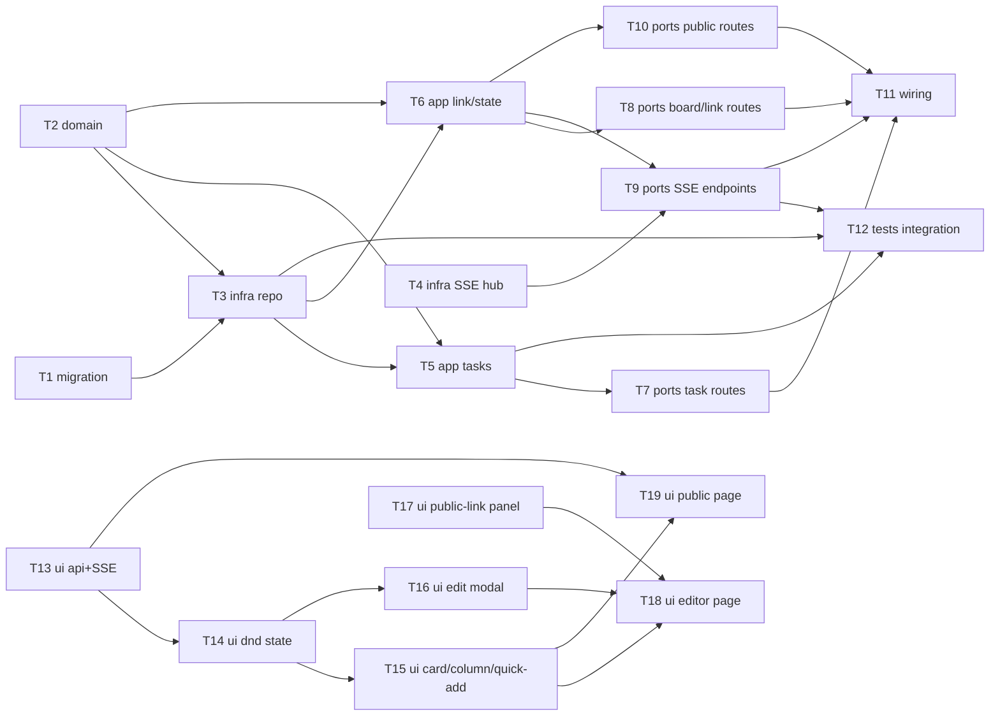

# Epic — board

> **Spec:** [spec.md](../spec.md) · **Design:** [sad.md](../sad.md) · **Data model:** [data-model.md](../data-model.md) · **API:** [openapi.yaml](../contracts/openapi.yaml) · **Events:** [events.md](../contracts/events.md) · **ADRs:** [adr/](../adr/)

## Goal

Ship the product's first domain module: one shared kanban board that a team member edits directly (create/edit/move/delete task, issue/revoke a public link) with no accounts, and that a viewer can open read-only via a public link that live-updates via SSE (spec §2 Goals, sad.md §4).

## Scope

- **In:** backend `board` module (domain/app/infra/ports, Postgres schema, SSE push), web SPA editor page + public read-only page, both target surfaces declared in `sad.md` frontmatter (`backend-service`, `web-frontend`).
- **Out:** sprints/estimates, multiple boards, accounts/roles, guest editing (spec §3 Non-goals). No new infra beyond the existing single-instance VPS stack (sad.md §7).

## Task map

## Tasks

See [tracker.md](./tracker.md) for status. Machine contract: [tasks.json](../tasks.json).

| # | Task | Layer | Blocked by | DoD (short) |
|---|---|---|---|---|
| T1 | Promote staged board migrations into the live migrations/ tree | migration | — | all 6 paired migrations apply and revert cleanly |
| T2 | Model board domain entities and sentinel errors | domain | — | Task rejects empty title (AC-02) |
| T3 | Implement Postgres repository for board, columns, tasks, public_links | infra | T1, T2 | repo covers AC-01/04/05/06 queries |
| T4 | Implement in-process SSE hub with per-token connection registry | infra | — | broadcast + close-by-token both tested |
| T5 | Implement task use-cases: create, edit, move, delete | app | T2, T3 | AC-01..AC-06 covered by unit tests |
| T6 | Implement public-link and board-state use-cases | app | T2, T3 | AC-07/08/09/11 covered by unit tests |
| T7 | Add HTTP handlers for task CRUD + move, with rate limiting on create | ports | T5 | AC-01..AC-06 handler tests + 429 rate limit |
| T8 | Add HTTP handlers for board state and public-link issue/revoke | ports | T6 | AC-07/08 handler tests |
| T9 | Add SSE endpoints for team-editor and public-viewer live updates | ports | T4, T6 | revoke closes registered connections (AC-11) |
| T10 | Add public-viewer HTTP handlers for read-only board access by token | ports | T6 | AC-09/10/11 handler tests |
| T11 | Wire the board module into main.go and register routes | wiring | T7, T8, T9, T10 | `make -C api run` boots, GET /api/v1/board 200 |
| T12 | Write integration tests for concurrent move and link-revocation invariants | tests | T3, T5, T9 | AC-05b + AC-11 integration tests pass |
| T13 | Build the board feature's typed API client and SSE subscription hook | ui | — | typed calls + refetch-on-event hook tested |
| T14 | Build drag-and-drop board state with optimistic updates | ui | T13 | AC-04/05 covered, rollback on failure |
| T15 | Build task card, column, and quick-add UI components | ui | T14 | AC-01/02 covered, reuses shared/ui |
| T16 | Build the edit-task modal (title, assignee, save, delete) | ui | T14 | AC-03/06 covered, reuses shared/ui |
| T17 | Build the public-link panel feature (issue/revoke) | ui | — | AC-07/08 covered, reuses shared/ui |
| T18 | Assemble the team-editor board page and register its route | ui | T15, T16, T17 | default page, no business logic in page |
| T19 | Assemble the public read-only board page and its unavailable-link state | ui | T13, T15 | AC-09/10/11 covered, SCR-05/06 |

**Total:** 19 tasks, ~11–12 person-days (~2.5 weeks) — within the ~3 person-week budget (sad.md §2 Organisational), with headroom for the live-push (ADR-0002) integration risk flagged in sad.md §11.

## Risks / Hard rules

- **No `authMW` on any board route** (ADR-0001, sad.md §8) — T11 wiring must register `board` without the existing `authMW`; adding it would silently break both the team-editor and public-viewer access model.
- **Columns are fixed, seeded, non-editable** (ADR-0004) — no task in this breakdown adds column CRUD; T2/T3 must not expose a create/update/delete path for `columns`.
- **Move is last-write-wins by design, no version/lock column** (spec §6 NFR, data-model.md `tasks`) — T3/T5 must not introduce optimistic-locking or a version column; T12 tests the invariant, it does not change it.
- **Revoke must synchronously close live SSE connections**, not just block new ones (sad.md §6 Flow 3, events.md connection lifecycle) — T9's DoD and T12's second integration test exist specifically to catch a revoke that only blocks future requests.
- **Rate limit is in-process, no new infra** (sad.md §8 crosscutting) — T7 must not introduce Redis or any shared store for the token bucket; it stays contained to the `board` module per the accepted single-instance deployment (sad.md §7).
- **Deadline risk (sad.md §11):** the workshop trigger date is still unconfirmed — flag to the owner (genkovich) before committing to the estimate above as a hard schedule.
