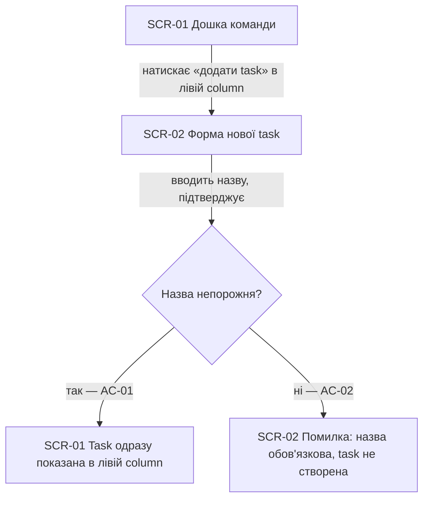
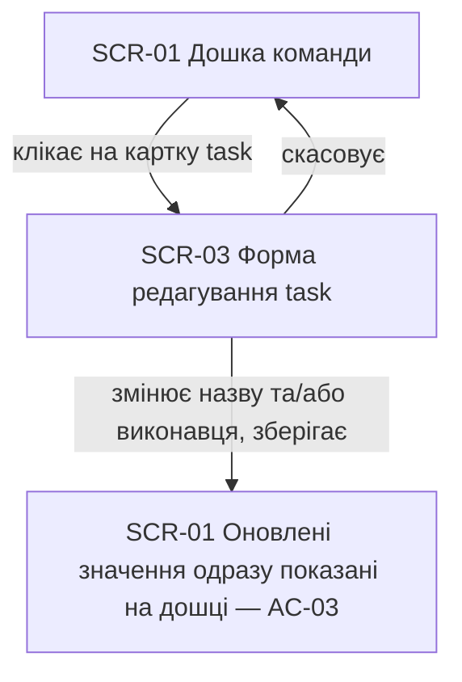
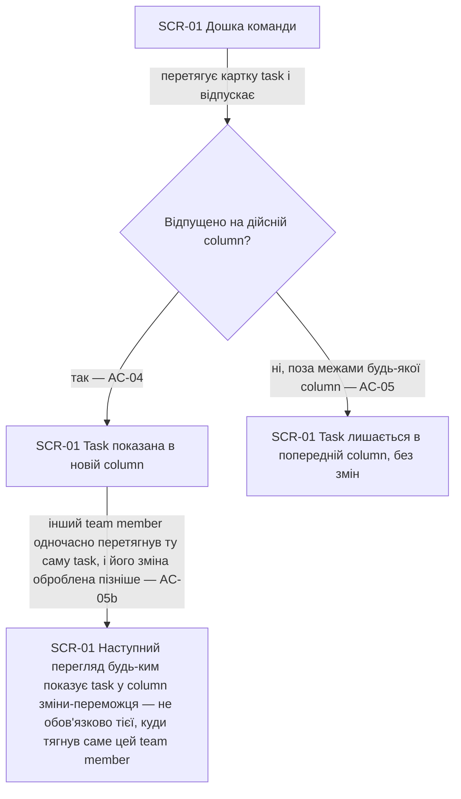
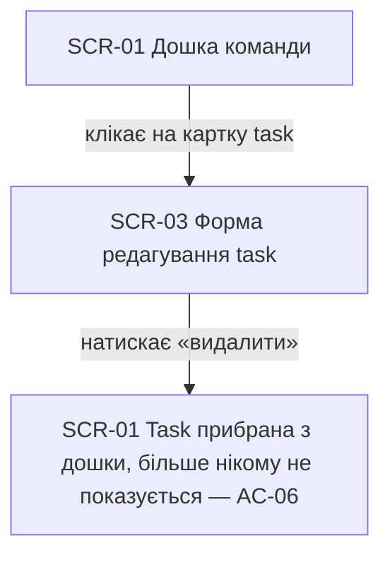
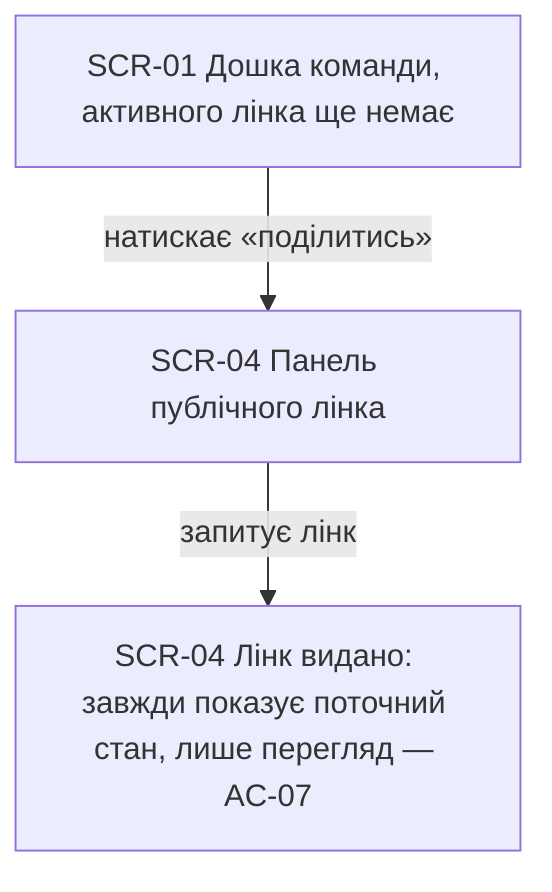
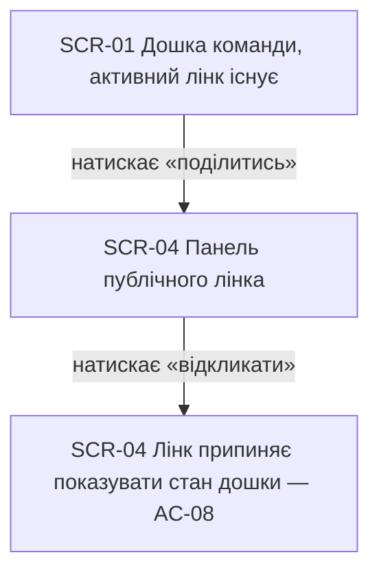
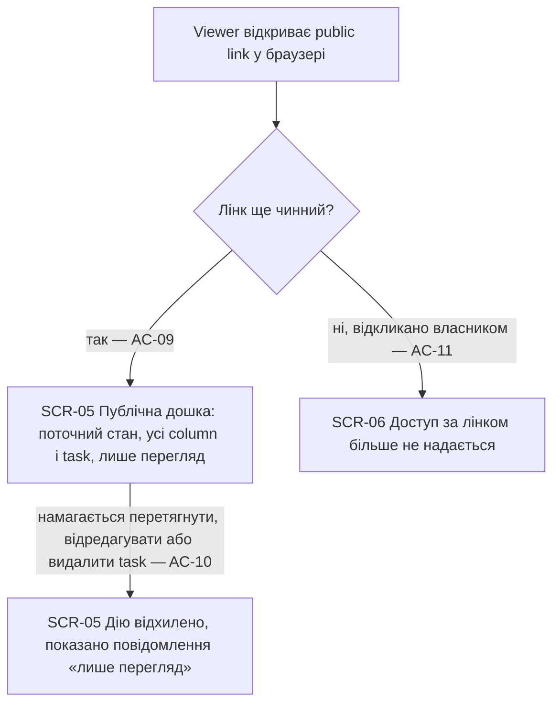

# UX flows — board

> User flows for every UI-touching §4 user story, produced by `ux-flows` (after `clarify`, before
> `design`) and read by `design` (evidence for the target-surface + UI-architecture decisions),
> `sequences` (UI-driven flows align on SCR ids), `screens` (details every inventory row) and
> `plan-tests` (the e2e-through-UI paths). **Always markdown + mermaid `flowchart`**, whatever the
> design tool — this artifact is flow-altitude, not visual design.

## Platform decisions

- **Posture:** mobile-first — обраний явно користувачем, попри те що спека (§1) натякає, що team
  member типово редагує board з ноутбука, а мобільний контекст стосується переважно viewer на
  воркшопі (US-07). Постава застосована до **всіх** флоу нижче, включно з editing (US-01–06):
  дошка спершу проєктується під найменший екран, потім прогресивно розширюється під desktop —
  drag-and-drop має працювати і через touch, і через мишу. `docs/design-system.md` у репо ще
  немає, тож це рішення — лише вхідні дані для `design`, а не остаточна архітектурна постава.
- **Створення task** — inline quick-add у найлівішій column (без окремого модального вікна): AC-01
  вимагає, щоб task одразу з'явилась там же, де її вводять, тож зайвий перехід екрану не потрібен.
- **Редагування task** — модальне вікно/панель з двома полями (назва, виконавець): відкривається
  кліком на картку.
- **Видалення task** — дія всередині тієї самої форми редагування (SCR-03), без окремого екрану
  підтвердження: спека не вимагає підтвердження, а зайвий SCR не додає ясності.
- **Керування публічним лінком** (отримати + відкликати) — один екран (SCR-04), який використовують
  обидва флоу US-05 і US-06: обидві дії стосуються того самого лінка.
- **AC-05b** (одночасне перетягування двома team member) показано як вузол-наслідок у флоу US-03, а
  не як окремий флоу — це системний інваріант узгодженості станів, а не окрема користувацька
  подорож.

## Screen inventory

| ID | Screen | Purpose | Entry | Exit |
|---|---|---|---|---|
| SCR-01 | Дошка команди (editor view) | Головний канбан-екран team member: колонки, картки task, дії створення/редагування/переміщення/видалення, вхід до керування лінком | Дефолтна сторінка продукту | SCR-02 (нова task), SCR-03 (редагування task), SCR-04 (панель лінка) |
| SCR-02 | Форма нової task | Inline quick-add поле назви в найлівішій column | Дія «додати task» на SCR-01 | Назад на SCR-01 (task створена або скасовано) |
| SCR-03 | Форма редагування task | Модальне вікно: назва, виконавець, збереження, видалення | Клік на картку task на SCR-01 | Назад на SCR-01 (збережено / видалено / скасовано) |
| SCR-04 | Панель публічного лінка | Показує стан лінка (є / немає), дії «отримати» і «відкликати» | Дія «поділитись» на SCR-01 | Назад на SCR-01 |
| SCR-05 | Публічна дошка (viewer view) | Read-only перегляд поточного стану дошки за public link | Відкриття URL публічного лінка | Немає (read-only, без подальшої навігації в продукті) |
| SCR-06 | Лінк недоступний | Повідомлення viewer, що лінк відкликано або недійсний | Відкриття URL відкликаного/недійсного лінка | Немає (глухий кут) |

## Flows

### Flow: US-01 — Створити задачу

Team member на дошці натискає «додати task» у найлівішій column і бачить inline-форму. Якщо
назва непорожня (AC-01), система одразу створює task і показує її саме в цій column. Якщо team
member намагається зберегти порожню назву (AC-02), система блокує створення й показує повідомлення
просто у формі, що назва обов'язкова — task не створюється.

### Flow: US-02 — Відредагувати задачу

Team member клікає на картку існуючої task і бачить форму редагування з назвою та виконавцем. Після
зміни й збереження (AC-03) дошка одразу показує нові значення. Скасування форми повертає на дошку
без будь-яких змін.

### Flow: US-03 — Перемістити задачу перетягуванням

Team member перетягує картку task в іншу column. Якщо відпустити її на дійсній column (AC-04),
дошка одразу показує task там. Якщо відпустити поза межами будь-якої дійсної column (AC-05), task
лишається на попередньому місці, ніби перетягування не відбувалось. Окремий випадок: якщо двоє
team member одночасно перетягнули ту саму task у різні column (AC-05b), система лишає її рівно в
одній column — тій, чия зміна дійшла останньою — і кожен наступний перегляд, включно з переглядом
того team member, чия зміна не «перемогла», показує саме цей єдиний узгоджений стан.

### Flow: US-04 — Видалити задачу

Team member відкриває ту саму форму редагування, що й у флоу US-02, і натискає «видалити». Task
одразу зникає з дошки (AC-06) і більше не показується жодному team member чи viewer.

### Flow: US-05 — Отримати публічний лінк

Team member, у якого ще немає активного публічного лінка, відкриває панель лінка і запитує його.
Система видає лінк (AC-07), який завжди показує поточний стан дошки лише на перегляд.

### Flow: US-06 — Відкликати публічний лінк

Team member із чинним публічним лінком відкриває ту саму панель і натискає «відкликати». Система
припиняє показувати стан дошки за цим лінком (AC-08).

### Flow: US-07 — Переглянути дошку за публічним лінком

Viewer відкриває збережений public link. Якщо лінк ще чинний (AC-09), система показує поточний
стан дошки з усіма column і task, лише на перегляд. Якщо лінк уже відкликано власником (AC-11),
viewer не бачить стан дошки й отримує повідомлення, що доступ за цим лінком більше не надається.
Якщо viewer на чинному лінку все ж намагається перетягнути, відредагувати або видалити task
(AC-10), система відхиляє цю дію і показує повідомлення, що дошка доступна лише на перегляд.

## AC coverage

| AC | Shown by | Notes |
|---|---|---|
| AC-01 | Flow US-01 → C (так) → D | happy path: valid name, task lands in leftmost column |
| AC-02 | Flow US-01 → C (ні) → E | error path: empty name blocked |
| AC-03 | Flow US-02 → B → C | happy path: edit saved and shown |
| AC-04 | Flow US-03 → B (так) → C | happy path: valid drop target |
| AC-05 | Flow US-03 → B (ні) → D | domain invariant: invalid drop reverts |
| AC-05b | Flow US-03 → C → E | concurrent-edit invariant: last write wins, shown as a consequence node, not a separate flow |
| AC-06 | Flow US-04 → B → C | happy path: task removed for everyone |
| AC-07 | Flow US-05 → B → C | happy path: link issued, always current + read-only |
| AC-08 | Flow US-06 → B → C | happy path: link stops serving state |
| AC-09 | Flow US-07 → B (так) → C | happy path: viewer sees current state |
| AC-10 | Flow US-07 → C → E | authorization: viewer's write attempt rejected |
| AC-11 | Flow US-07 → B (ні) → D | cross-context: revoked link shows no state |
