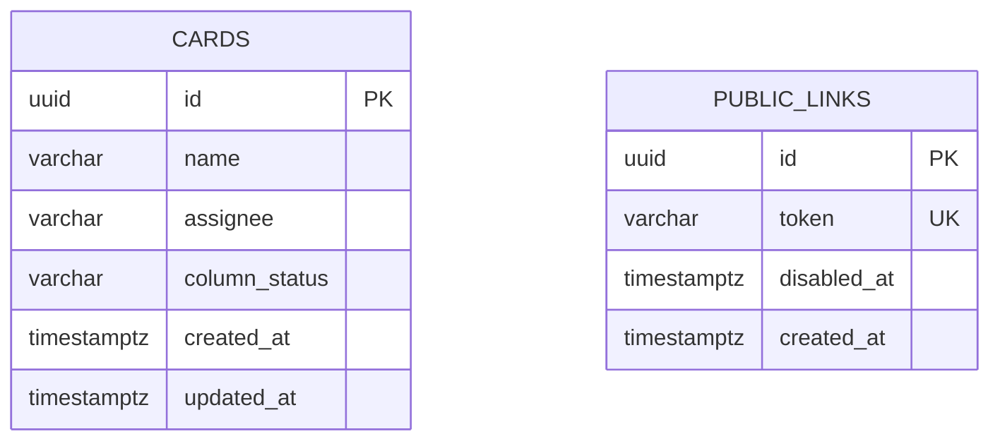

# Data model — tasks

## ER diagram

No foreign key between `cards` and `public_links` — they're unrelated aggregates over the single implicit board (spec: exactly one board exists system-wide, so no `boards` table is needed).

## Entities

### `cards`

| Column | Type | Constraints | Notes |
|---|---|---|---|
| `id` | UUID | PK, app-generated (UUID v7) | matches the repo's `users` table convention |
| `name` | VARCHAR(200) | NOT NULL | bound from spec §6 NFR "назва ≤ 200 символів"; empty/whitespace-only rejected at the app layer (`ErrNameRequired`) |
| `assignee` | VARCHAR(100) | NULL | optional free-text, bound from spec §6 NFR "виконавець ≤ 100 символів" |
| `column_status` | VARCHAR(20) | NOT NULL | one of `todo` / `in_progress` / `done` — validated at the app layer, not a DB `CHECK` (the repo doesn't use `CHECK` constraints anywhere today) |
| `created_at` | timestamptz | NOT NULL DEFAULT now() | also the in-column ordering key — cards within a column sort by `created_at` (clarify decision: no manual reordering) |
| `updated_at` | timestamptz | NOT NULL DEFAULT now() | app sets this on every write — the last-write-wins ordering signal, ADR-0002 |

**Aggregate root:** root (no parent).
**Access patterns:** read the whole board (`SELECT * FROM cards ORDER BY column_status, created_at`) — a full scan of a small table, no index needed at this scale (≤7 team members' worth of cards).
**Constraints:** none beyond `NOT NULL` — no `UNIQUE`, no `FK`, no `CHECK` (matches the repo's current style).

### `public_links`

| Column | Type | Constraints | Notes |
|---|---|---|---|
| `id` | UUID | PK, app-generated (UUID v7) | internal identity only — never exposed in the public URL |
| `token` | VARCHAR(255) | NOT NULL, UNIQUE | the public-URL token — **not** `uuid.NewV7()`; `crypto/rand`-backed 128-bit random (or UUIDv4), per ADR-0003, so it carries no inferable timestamp |
| `disabled_at` | timestamptz | NULL | `NULL` = active; set once, never cleared (ADR-0003) |
| `created_at` | timestamptz | NOT NULL DEFAULT now() | audit only |

**Aggregate root:** root (no parent).
**Access patterns:** resolve by token (`SELECT * FROM public_links WHERE token = $1 AND disabled_at IS NULL`) — served by the `UNIQUE` index on `token`, no separate index needed.
**Constraints:** `UNIQUE` on `token`. Every `generate` call inserts a **new** row rather than mutating an existing one — the link history is kept, and "exactly one active link" is a service-layer invariant (the service disables any currently-active row before inserting the new one), not a DB constraint — matching the repo's current unconstrained style.

## Indexes

| Index | Columns | Query it serves |
|---|---|---|
| `public_links_token_key` (implicit, from `UNIQUE`) | `token` | resolve a public link by its token (Flow: Viewer opens the public link) |

No index is added on `cards` — the full-board read (`GET /board`-style query, all rows) is a scan of a table small enough (single-digit-to-low-hundreds of cards for a 3–7-person team) that an index would add write cost with no measurable read benefit at this scale.

## Test fixtures

- `tasks.NewTestCard(t, opts...)` — builds a `domain.Card` with sensible defaults (name `"Test card"`, no assignee, `column_status: "todo"`), overridable via functional options — matches the `internal/modules/user/` test-fixture pattern.
- `tasks.NewTestPublicLink(t, opts...)` — builds a `domain.PublicLink` with a random token and `disabled_at: nil`.
- No seed data in `migrations/` — the board starts empty and no public link exists until a team member generates one (AC-09); no admin/lookup rows apply to this module.
