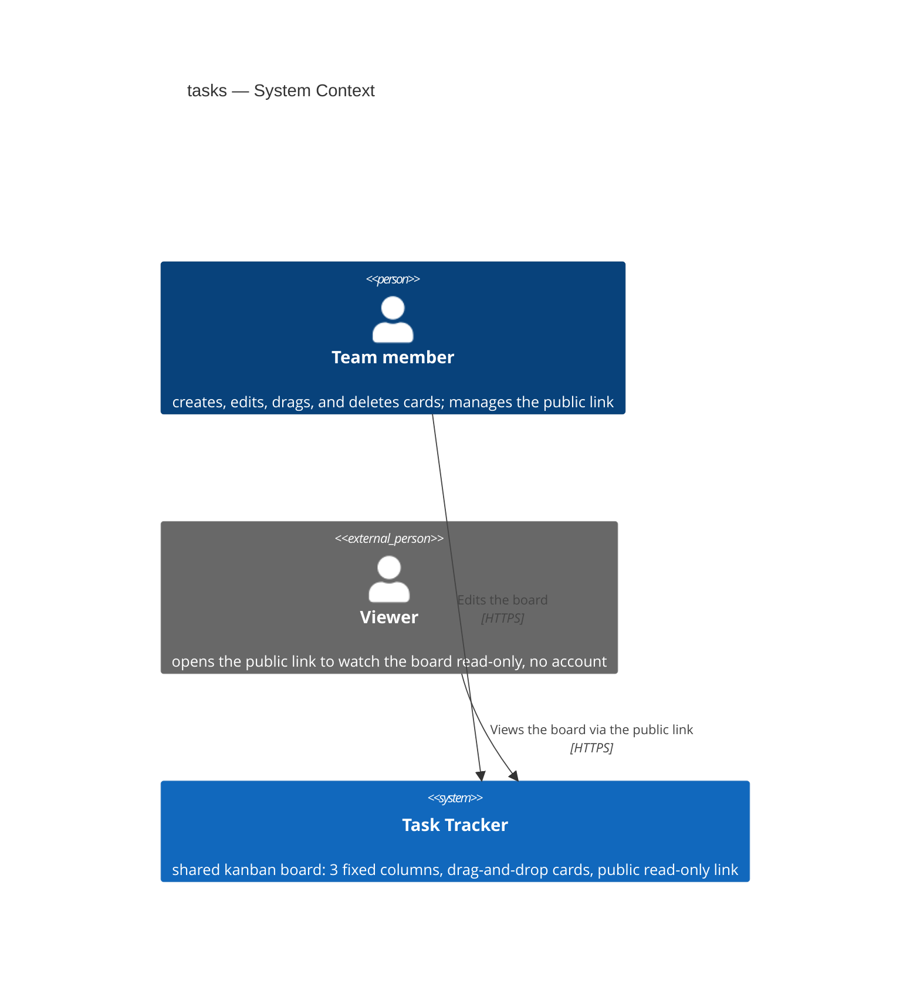
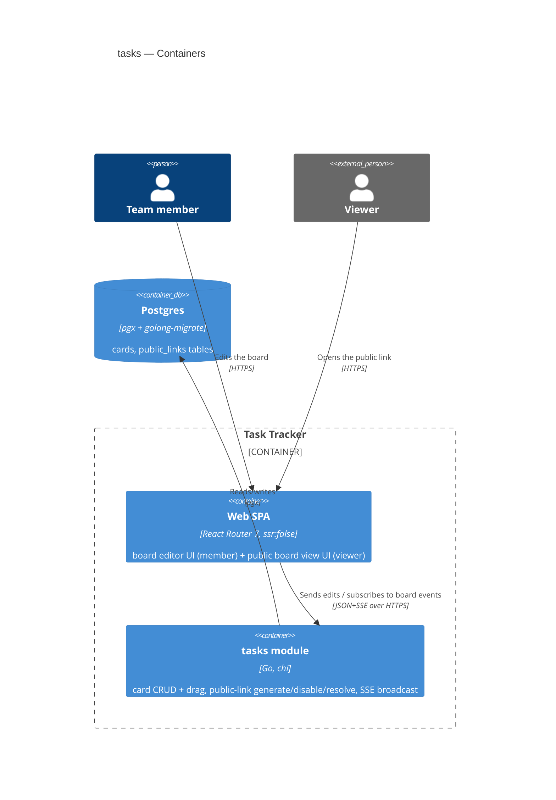
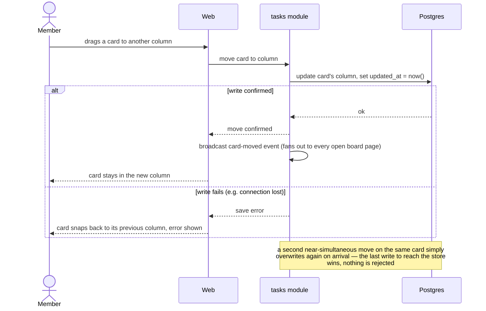
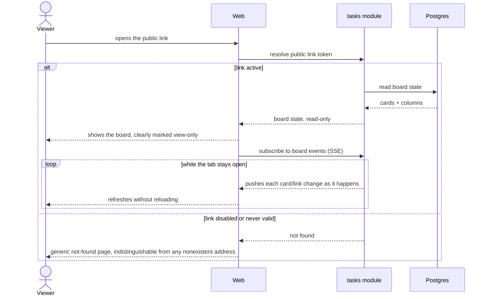
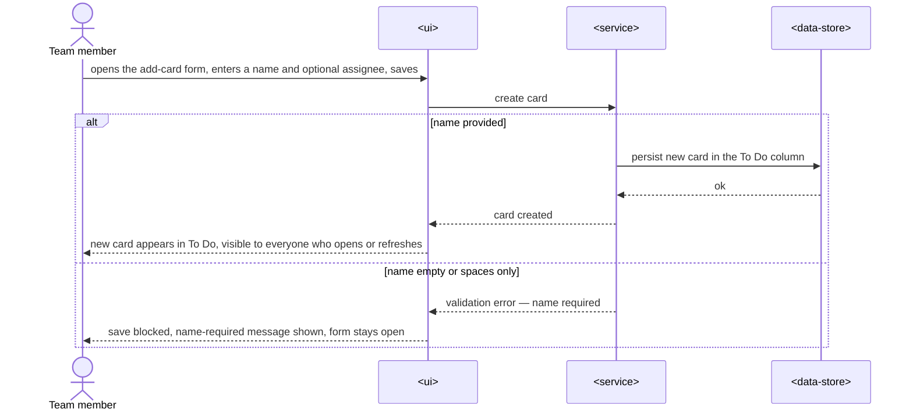
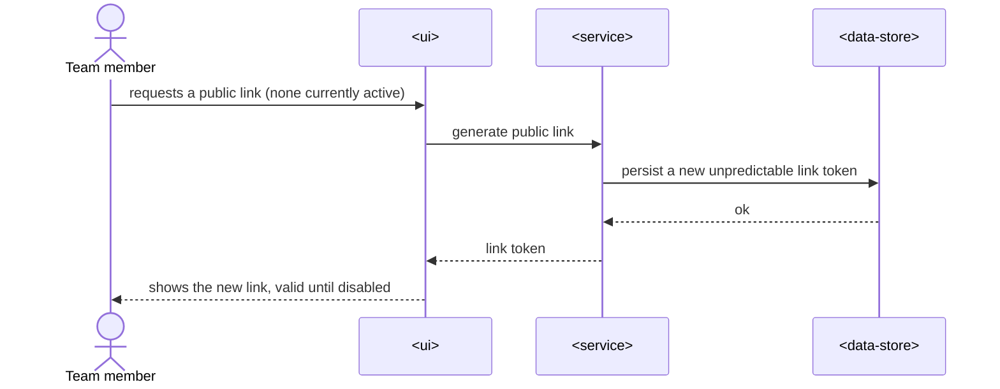
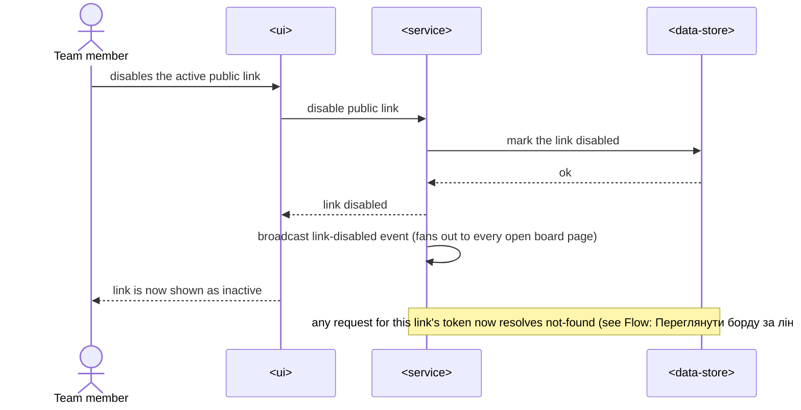
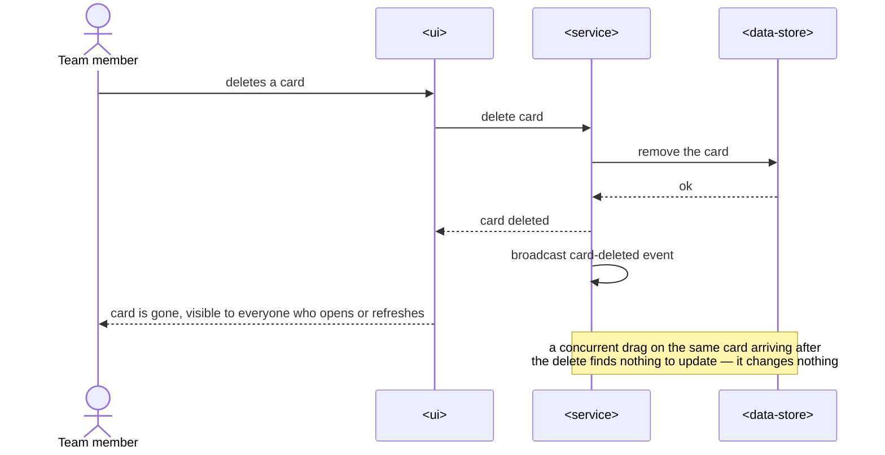
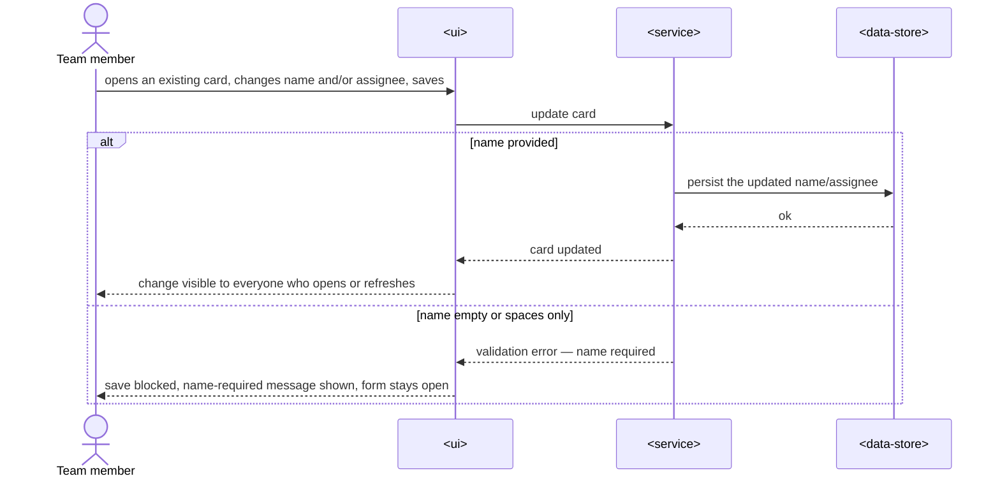

# Software Architecture Document — tasks

<!-- 12 Arc42 sections. Empty section → <!-- N/A: <reason> -->. -->
<!-- C4 Context (L1) lives inline in §3. C4 Container (L2) lives inline in §5. -->
<!-- Numbers in §10 come VERBATIM from spec.md §6 NFR — no inventing, no rounding. -->

## 1. Introduction and goals

**Intent.** The `tasks` feature gives a small team (3–7 people) a single shared kanban board with three fixed columns — To Do → In Progress → Done. Team members create, edit, drag, and delete cards from their own devices, and every change is visible to the whole team immediately, whichever device they're on. A team member can also generate and disable an unpredictable public read-only link so people outside the team — a stakeholder, a client, a workshop audience — can watch the board's current state live, without an account.

**Top-3 quality goals (1-liners; full scenarios in §10):**

1. Concurrency/accuracy correctness — the last change to reach the server wins on a near-simultaneous edit to the same card, and every viewer converges on that same final state (AC-07, AC-15).
2. Interaction latency — drag-and-drop feels instantaneous, by touch and by mouse, because the workshop demo depends on cards visibly moving in real time, not looking like a static mockup.
3. Public-access correctness and availability — a disabled or never-valid link always resolves as a generic not-found (no existence leak), an active link reflects the team's current state without a stale snapshot, and the board holds up for the workshop's viewing window.

**Stakeholders.**

| Role | Interest | Sign-off owner? |
|---|---|---|
| Team member (учасник команди) | Creates/edits/drags/deletes cards, manages the public link | No |
| Viewer (глядач) | Opens the public link, watches the board read-only | No |
| Tech Lead | SAD approval | Yes |
| Security Lead | Reviews the public-link authorization boundary (spec §6.1: Security review required) | Yes |

<!-- Decision overrides (¶4) — none yet. -->

## 2. Constraints

**Technical.**
- Go (repo's fixed backend toolchain, `api/`) + chi router + pgx + golang-migrate against Postgres — README.md, `api/CLAUDE.md`.
- React Router 7 SPA (`ssr:false`) + Tailwind 4 + shadcn primitives — README.md, `web/CLAUDE.md`; mobile-first posture already set by `ux-flows.md`.
- Module layering convention: `domain/ app/ infra/ ports/` per module, consumer-side interfaces, manual constructor injection (no DI framework) — `api/internal/modules/user/` is the exemplar; `.claude/rules/go-design-patterns.md`.
- Frontend feature-slice convention: `api/ model/ ui/` per slice under `web/src/features/`, no cross-slice imports — `web/CLAUDE.md`.

**Organisational.**
- Effort budget: size S (~1 week) — spec §1 decision override: Approach C's domain here is narrower than the idea-brief's general M estimate (no accounts, no history, free-text assignee). This budget explicitly includes ADR-0001's in-process SSE broadcaster + handler (§5) — a small addition (no new deployable, no new datastore), not a size-class change; see spec §1's second decision override for the traceability note on why the spec's original "no persistent connections" phrasing doesn't block this.
- Deadline: the workshop date is not fixed yet (spec §8 open question, owner genkovich); once set it becomes a hard external deadline for §1 quality goal 3 (availability).
- Team: repo owner, small crew.

**Conventions.**
- Error response shape `{"error":{"code":"domain.snake_case","message":"..."}}`, mapped from domain sentinel errors in `ports/errors.go` — `.claude/rules/go-errors.md`, `internal/platform/httputil/`.
- All routes inherit the shared middleware stack (CORS, security headers, RequestID, Logger, Recoverer, 30 s request timeout, 1 MB body limit, and a **60 req/min-per-IP rate limiter** — `httprate.Limit(60, time.Minute, WithKeyFuncs(clientIPKey))`) — `internal/server/server.go:139-152`, `.claude/rules/go-security.md`. §7/§8 below cover the exemptions the `tasks` routes need from this default.

**Regulatory / external.**
- Data classification: internal (spec §6.1) — board content is deliberately shown to a wider audience via the public link but not meant for search indexing or a long-term public archive.
- Personal data: assignee free-text name only, unvalidated against any real user list (spec §6.1).
- Security review required before ship — the public-link boundary is new authorization surface even at size S (spec §6.1).

## 3. Context and scope

A small team keeps one shared board of its current work. Team members edit the board directly from their own devices — no login. A team member can generate a single public, unpredictable link that always shows the board's live state to anyone holding it, read-only, until the team disables it.

<!-- brownfield: Go monolith scaffolded from base-tpl (api/ + web/), no product feature module exists yet — `tasks` is the first domain module added under api/internal/modules/. -->

**External systems (in / out):**

| Actor or system | Type | Interaction |
|---|---|---|
| Team member | Person | Creates/edits/drags/deletes cards; requests/disables the public link |
| Viewer | Person | Opens the public link; watches the board read-only |
| — | — | No third-party integration introduced. The repo's Google OAuth/JWT infra exists but is deliberately unused here (spec §3 Non-goals — no accounts for board editing) |

**C4 Context (L1):**



The Context shows two people talking to one system: the team member, who edits the board with no login, and the viewer, who only ever reads it through a public link. Nothing outside the box — the feature deliberately introduces no third-party dependency.

## 4. Solution strategy

**Top strategic choices (the seeds for ADRs):**

1. **Target surfaces: `[backend-service, web-frontend]`.** Reuse the repo's existing `api/` (Go backend-service) and `web/` (React SPA) containers — both already exist as the base-tpl scaffold; no mobile/desktop surface is introduced.
2. **UI-architecture (web-frontend): SPA, no SSR.** Fixed by the repo (`ssr:false`); mobile-first posture already set by `ux-flows.md`. No new state-management library — board state lives in the board page's own fetch/subscribe state, per the existing feature-slice convention (no global store observed in the repo).
3. **Single in-process module, synchronous integration.** A new module `tasks` inside the existing Go monolith, wired through the existing pattern `server.New(..., tasks.New(db), ...)` — no cross-module events, no separate service.
4. **Persistence: two new module-owned tables.** `cards` + `public_links` in the existing Postgres instance. Columns are a fixed enumerated order, not a database table — spec §3 Non-goals rules out column CRUD.
5. **No cache tier.** Direct Postgres reads are comfortably sufficient at the stated scale (≤7 team members, ≥30 concurrent viewers).
6. **Push-based realtime sync over Server-Sent Events (SSE) — ADR-0001.** Team edits and public-link state changes are broadcast to every open board page (editor and viewer) as soon as they happen, instead of the client polling for changes.
7. **Server-authoritative last-write-wins concurrency — ADR-0002.** Every card write unconditionally overwrites, timestamped by the server; the server's processing order — not a client-supplied value — decides which change is "last".
8. **Opaque random public-link token with a `disabled_at` flag — ADR-0003.** The link's unguessability plus a boolean-like flag (not deletion, not a signed/stateless token) satisfy AC-04/AC-05/AC-09 together.

Each tactical decision in later sections traces to one of these eight. ADR-0001's push choice is the one item that diverges from the cheapest default (polling) — it commits the feature to owning a small piece of new infrastructure (an in-process SSE broadcaster) that §5/§7/§11 account for.

## 5. Building block view

Layered / hexagonal, matching the repo's existing module convention exactly (`domain/ app/ infra/ ports/`, consumer-side interfaces, manual constructor injection) — no divergence from `internal/modules/user/`. The one addition beyond that convention is an in-process event broadcaster (for ADR-0001's SSE push), which lives in `app/` next to the service and is wired the same way.

**Internal decomposition:**

```
api/internal/modules/tasks/
├── domain/       <Card, PublicLink entities + sentinels: ErrCardNotFound, ErrNameRequired,
│                  ErrCardFieldTooLong (name > 200 or assignee > 100 chars, spec §6 NFR),
│                  ErrLinkNotFound, ErrLinkDisabled>
├── app/          <Service: CreateCard, UpdateCard, MoveCard, DeleteCard, GetBoard,
│                  GenerateLink, DisableLink, ResolvePublicLink
│                  Broadcaster: in-process pub/sub — Publish(BoardEvent), Subscribe() <-chan BoardEvent>
├── infra/        <PostgresCardRepository, PostgresPublicLinkRepository>
├── ports/        <Handler: board-edit routes (no auth middleware, per spec) +
│                  public board-view route keyed by link token +
│                  SSE handler (subscribes to Broadcaster, streams board events)>
└── tasks.go      <module wiring: New(db) constructs repo → service+broadcaster → handler>
```

"Board-edit routes" are not auth-gated — spec §3 Non-goals excludes login for editing; §8 below documents this as the feature's one authorization boundary (the public link, not team-member identity).

**C4 Container (L2):**



One backend container and one web container, matching the two declared target surfaces — no separate worker: the SSE broadcaster is in-process inside the same `api` container, not a standalone deployable. The web SPA both sends edits (member) and opens a persistent event subscription (member + viewer) against the same `api` container.

## 6. Runtime view

**Critical flow 1: Drag a card to another column (AC-01, AC-07, AC-11)**



The member drags a card; the service writes the new column and a fresh server timestamp, then broadcasts the change to every open page. If the write can't be confirmed, the card visually snaps back and the member sees an error (AC-11). If two members move the same card almost at once, whichever write the server processes last simply overwrites the other — both members end up seeing that final column (AC-07).

**Critical flow 2: Viewer opens the public link, board stays live, link gets disabled (AC-04–AC-06, AC-08, AC-09, AC-12)**



A viewer opening an active link sees the board's live state immediately — never a stale snapshot (AC-08) — and stays subscribed to further changes for as long as the tab is open, including the team disabling the link itself, which the same subscription delivers as a switch to not-found without a manual refresh (AC-12). A disabled or never-valid link resolves to the same generic not-found either way (AC-05), and the active board never exposes an edit control to the viewer (AC-06).

### Flow: Add a new card (US-02, AC-02, AC-03)



A team member opens the add-card form, enters a name and an optional assignee, and saves. If a name was provided, the service persists the new card into the To Do column and everyone who opens or refreshes the board sees it (AC-02). If the name is empty or whitespace-only, the service rejects the save and the UI keeps the form open with a name-required message (AC-03).

### Flow: Generate the public link (US-03, AC-09)



With no active link, a team member requests one; the service generates and persists a new unpredictable token and the UI shows it to the team member, valid until someone disables it (AC-09).

### Flow: Disable the public link (US-05, AC-04)



A team member disables the active link; the service marks it disabled and broadcasts the change immediately (AC-04) — this is the event the viewer-side flow's open subscription picks up to switch to not-found without a manual refresh (AC-12).

### Flow: Delete a card (US-06, AC-10, AC-15)



A team member deletes a card; the service removes it and everyone who opens or refreshes the board sees it gone (AC-10). If another member's drag on that same card reaches the service after the delete, there's nothing left to update, so it changes nothing on the board — the delete wins (AC-15).

### Flow: Edit a card (US-07, AC-13, AC-14)



A team member opens an existing card, changes its name and/or assignee, and saves. If a name is present, the update persists and everyone who opens or refreshes the board sees it (AC-13); if the name is empty or whitespace-only, the save is blocked with a name-required message and the form stays open (AC-14).

### Coverage

**Use-case coverage (§4 user stories):**

| User story | Flow(s) |
|---|---|
| US-01 Drag a card | Flow: Drag a card to another column |
| US-02 Add a new card | Flow: Add a new card |
| US-03 Get a public link | Flow: Generate the public link |
| US-04 View the board via the link | Flow: Viewer opens the public link |
| US-05 Disable the public link | Flow: Disable the public link |
| US-06 Delete a card | Flow: Delete a card |
| US-07 Edit a card | Flow: Edit a card |

**AC coverage (§5 acceptance criteria):**

| AC | Shown by |
|---|---|
| AC-01 | Flow: Drag a card — happy path |
| AC-02 | Flow: Add a new card — happy branch |
| AC-03 | Flow: Add a new card — error branch |
| AC-04 | Flow: Disable the public link |
| AC-05 | Flow: Viewer opens the public link — disabled/never-valid branch |
| AC-06 | Non-runtime — the viewer UI simply never renders an edit control; nothing to sequence |
| AC-07 | Flow: Drag a card — concurrent-move note |
| AC-08 | Flow: Viewer opens the public link — active-link branch |
| AC-09 | Flow: Generate the public link |
| AC-10 | Flow: Delete a card — happy path |
| AC-11 | Flow: Drag a card — save-failure branch |
| AC-12 | Flow: Viewer opens the public link — SSE subscription loop, fed by Flow: Disable the public link |
| AC-13 | Flow: Edit a card — happy branch |
| AC-14 | Flow: Edit a card — error branch |
| AC-15 | Flow: Delete a card — concurrent-delete-vs-drag note |

## 7. Deployment view

Reuses the existing deployment unit end to end: GHCR images → VPS → Caddy auto-TLS, per the repo's existing `deploy/` + `.github/workflows/deploy.yml` — no new infrastructure, no new exposed port. The `tasks` module ships inside the same `api` binary and the board UI inside the same `web` SPA bundle already deployed today. This resolves spec §8 open question 1 ("where is the board hosted so the public link is stable from phones during the workshop?") — the answer is the same VPS the base-tpl already deploys to, behind the same Caddy TLS termination.

Two deployment-relevant additions from ADR-0001: the SSE route must be exempted from the shared 30 s request-timeout middleware (`internal/server/server.go`), since an SSE connection is meant to stay open for as long as the page is; and the SSE route needs headroom in — or an exemption from — the shared 60 req/min-per-IP rate limiter (§2, §8), since a shared venue Wi-Fi's public IP could see a burst of *reconnects* (not steady polling) if the network drops and many open tabs' `EventSource` instances retry at once.

**Monitoring:**
- Reuse the existing `/metrics` Prometheus scrape + Grafana dashboard (`deploy/grafana/dashboards/`) — add a panel for open SSE-connection count before the workshop so a runaway client (e.g. a tab left open for days) is visible.
- Alert: none new for v1 — manual monitoring during the workshop window per spec §6 (Availability measurement is manual).

**Scaling thresholds:**
- Comfortable as-is up to the stated ≥30 concurrent viewers, each holding one open SSE connection — well inside a single Go process's connection budget.
- The in-process broadcaster works only while the `api` runs as a single instance (today's deployment). If the API is ever horizontally scaled, the broadcast would need to move to a shared channel (e.g. Postgres `LISTEN`/`NOTIFY`) — noted as accepted debt in §11, not built now.

## 8. Crosscutting concepts

| Concept | Convention | Where defined |
|---|---|---|
| Logging | structured, repo default (RequestID + Logger middleware) | `internal/server/server.go` |
| Authentication | none for board editing (deliberate — spec §3 Non-goals); the repo's Google OAuth/JWT stays unused by this module | spec.md §3, §6.1 |
| Authorization | one boundary: possessing the public-link token grants read-only access; no token, no access. Editing itself is unauthenticated by design | ADR-0003, spec §6.1 |
| Error handling | domain sentinel → `ports/errors.go` mapping → `{"error":{"code","message"}}` JSON, repo default | `.claude/rules/go-errors.md` |
| ID strategy (table PKs) | repo default — time-ordered `uuid.NewV7()`, consistent with the `user` module | `internal/modules/user/app/app.go`, `api/CLAUDE.md` |
| ID strategy (public-link token) | **deviates from the repo default** — `crypto/rand`-backed 128-bit random (or UUIDv4), never UUIDv7: v7 encodes a timestamp, which would make the token partly guessable and contradict AC-09's unpredictability requirement | ADR-0003 |
| Rate limiting | inherits the repo's 60 req/min-per-IP default (§2); the SSE subscribe route needs headroom for reconnect bursts (§7) — exact exemption/limit shape is an implementation decision at `tasks`, not re-litigated here | §2, §7 |
| Input validation | card name ≤ 200 chars, assignee ≤ 100 chars, checked on save — domain sentinel `ErrCardFieldTooLong` (§5) | spec §6 NFR "Обмеження довжини полів картки" |
| Realtime transport | Server-Sent Events over a dedicated route, exempted from the shared 30 s request timeout; in-process pub/sub, single API instance for v1 | ADR-0001, §7 |
| Internationalisation | N/A — single language UI text, no i18n framework introduced | — |
| Observability | reuse existing request logging + `/metrics`; add an open-SSE-connection gauge (§7) | — |

## 9. Architecture decisions

| # | Title | Status | Section |
|---|---|---|---|
| 0001 | Push board changes to open pages over Server-Sent Events | Accepted | §4 |
| 0002 | Resolve concurrent card writes as last-write-wins via a server-assigned timestamp | Accepted | §4 |
| 0003 | Use an opaque random token with a `disabled_at` flag for the public board link | Accepted | §4 |

ADR files live under `docs/features/tasks/adr/`.

## 10. Quality requirements

**QG-1. Concurrency / Accuracy (last-write-wins)**
- **When:** two team members drag the same card to different columns within the same short window, or one drags while another deletes it.
- **Then:** the server accepts the last-arrived change as final (AC-07); a concurrent delete always wins over a drag on the same card, and the card disappears for everyone (AC-15) — per spec §6 NFR row "Concurrency / Accuracy: останній запит на зміну колонки перемагає (AC-07); видалення перемагає над одночасним перетягуванням (AC-15)".
- **How verify:** an integration test that fires two near-simultaneous update requests against the same card id (and a delete+move pair) and asserts the final DB state matches "the last request the server processed wins".

**QG-2. Interaction latency**
- **When:** a team member releases a dragged card.
- **Then:** the client-measured time from release to confirmed change is p95 ≤ 300 ms — per spec §6 NFR row "Latency p95 переміщення картки (drag) | ≤ 300 ms | клієнтський час від відпускання картки до підтвердженої зміни", and works by touch as well as by mouse per the same NFR table's "Touch-переміщення карток" row.
- **How verify:** primarily a client-side measurement — an automated or manual timing from the drag-release event to the UI reflecting the confirmed move, matching spec §6's own measurement definition ("клієнтський час від відпускання картки до підтвердженої зміни"); a server-side load/latency test against the move-card endpoint is a supporting signal only (it bounds the server's contribution to that client-measured number, it isn't the number itself). Plus the manual touch-device smoke test spec §6 requires before the event.

**QG-3. Public-access correctness and availability**
- **When:** a viewer opens a public link that is disabled or was never valid, versus one that's active and just changed by the team.
- **Then:** the disabled/never-valid case renders a generic not-found indistinguishable from a nonexistent address (AC-05); the active case renders the board within p95 ≤ 500 ms — spec §6 NFR row "Latency p95 завантаження борди глядачем | ≤ 500 ms" — and reflects a just-made team change within ≤ 5 s while the tab stays open — spec §6 NFR row "Свіжість борди в глядача ... ≤ 5 с"; the service holds 99% availability during the workshop window — spec §6 NFR row "Availability | 99% протягом вікна воркшопу".
- **How verify:** an integration test asserting an identical response shape/status for a disabled vs a never-existent link token; a load test measuring first-render p95 for the public board endpoint; an SSE-delivery test asserting a card change reaches an open subscriber well inside the 5 s target.

## 11. Risks and technical debt

| Risk / debt | Severity | Mitigation | Owner |
|---|---|---|---|
| The in-process SSE broadcaster only works with a single `api` instance; horizontal scaling would silently stop fanning events out to connections on other instances | Medium | documented in §7 as a scaling threshold; move to Postgres `LISTEN`/`NOTIFY` (or similar shared channel) if the API is ever scaled beyond one instance | Backend |
| Board editing has no authentication at all — anyone with network access to the API can write to the board | Medium (accepted) | inherited from spec §3 Non-goals / §6.1 — a trusted 3–7-person team is the accepted boundary; not re-litigated here | genkovich |
| No backup mechanism for board state before the demo | Low | carried from spec §8 open question — no separate backup planned, relies on Postgres persistence; resolve before the workshop date | genkovich |
| Exact workshop availability window is unknown | Low | carried from spec §8 open question — manual monitoring covers the actual event once the date is set; resolve before the workshop date | genkovich |

**Accepted debt (acceptable in v1, plan to fix later):**
- Board editing is unauthenticated by design (v1 scope, per spec) — acceptable for a trusted 3–7-person team; would need real auth if the editing surface ever opened beyond the team.
- No caching tier and no shared broadcast channel — acceptable at the stated ≤30-viewer, single-instance scale; revisit both together if usage grows well past workshop scale.

## 12. Glossary

| Term | Meaning |
|---|---|
| Board (борда) | the single shared kanban board; there is exactly one board in the system, no navigation between multiple boards |
| Card (картка) | a unit of work inside a column; has a name and an optional free-text assignee; can be dragged between columns |
| Column (колонка) | a fixed named stage of work; the board always has exactly three, in order: To Do → In Progress → Done |
| Assignee (виконавець) | free-text name on a card, not validated against any user/account list |
| Viewer (глядач) | a person without an account who opens the board via the public link, read-only |
| Team member (учасник команди) | a person from the 3–7-person team who edits the board — creates/drags/edits/deletes cards, manages the public link |
| Public link (публічний лінк) | one unpredictable URL that serves the board's current state read-only; stays valid until a team member disables it |
| Status (статус) | a card's current stage, determined solely by which column it's in |
| Last-write-wins | the concurrency rule: the most recently server-processed change to a card overrides any earlier one still in flight — no rejection, no merge (ADR-0002) |
