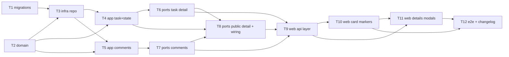

# Epic — tasks

> **Spec:** [spec.md](../spec.md) · **UX flows:** [ux-flows.md](../ux-flows.md) · **Data model:** [data-model.md](../data-model.md) · **API:** [openapi.yaml](../contracts/openapi.yaml) · **Test plan:** [test-plan.md](../test-plan.md)

## Goal

Добудувати task із «назва + виконавець» до робочої одиниці: опис, пріоритет, дедлайн і
коментарі; показати їх компактними маркерами на картці й повністю — у детальній модалці,
однаково доступній редакторові й глядачеві за публічним лінком (spec §2).

## Scope

- **In:** дельта до модуля `board` (домен, репозиторій, use-case-и, HTTP), дві міграції,
  детальна модалка й маркери на картці у web, публічний детальний GET у високотрафічному
  тирі.
- **Out:** вкладення, редагування коментарів, сповіщення про дедлайн, сортування колонки
  за пріоритетом, історія змін задачі (spec §3). Нового модуля не зʼявляється: деталі
  задачі — це та сама task із фічі board.

## Task map

## Tasks

Статуси — у [tracker.md](./tracker.md). Машинний контракт — [tasks.json](../tasks.json).

| # | Task | Layer | Blocked by | DoD (short) |
|---|---|---|---|---|
| T1 | Promote the staged migrations into the live tree | migration | — | обидві пари накочуються й відкочуються чисто |
| T2 | Extend the task domain + Comment entity | domain | — | межі й закритий набір пріоритетів у юніт-тестах |
| T3 | Persist details and comments; card fields in board state | infra | T1, T2 | стан дошки без тіла опису, з прапорцем і лічильником |
| T4 | Task use-cases + task-detail reads (editor and token-scoped) | app | T2, T3 | чужа дошка за токеном відмовлена як недійсний лінк |
| T5 | Comment use-cases with board-scoped broadcast | app | T2, T3 | рівно один broadcast у бакет дошки задачі |
| T6 | Task detail GET + нові поля на create/edit | ports | T4 | 400 на кривий due_date, 422 на опис/пріоритет |
| T7 | Comment routes (list, add, delete) | ports | T5 | 404 замість FK-500 на неіснуючій задачі |
| T8 | Public task detail у тирі 300/хв + wiring | ports | T4, T6, T7 | 61-й запит проходить, 301-й ні; чужа задача → 404 |
| T9 | Web API layer (типи + клієнт) | ui | T6, T7, T8 | типи дзеркалять контракт, typecheck чистий |
| T10 | Маркери на картці | ui | T9 | пріоритет/дедлайн/опис/коментарі, протермінований — destructive |
| T11 | Детальна модалка редактора + read-only глядача | ui | T9, T10 | у глядацькій немає жодного поля вводу |
| T12 | E2E наскрізь + CHANGELOG | ui | T10, T11 | створити → деталі → маркери → публічний перегляд |

**Total:** 12 задач, ~5–6 людино-днів.

## Risks / Hard rules

- **Публічний детальний GET мусить перевіряти дошку токена** — задача іншої дошки
  віддається як недійсний лінк (TSK-13). Пропустити цю перевірку = IDOR між дошками:
  будь-хто з одним публічним лінком читав би деталі всіх задач продукту.
- **Стан дошки не тягне описи** (spec §6): у `TaskCard` є `has_description`, а не
  `description`. Інакше кожен SSE-refetch дошки качав би всі описи.
- **Лічильник коментарів — агрегат на колонку, не запит на задачу** (data-model.md):
  інакше дошка на 100 задач дає 100 зайвих запитів на кожен рендер.
- **Жодного FK з `task_comments.author` на `users`** — акаунтів на рівні дошки немає
  (ADR-0001 фічі board); ім'я в формі лише предзаповнюється.
- **Домен лишається первинним валідатором** пріоритету; CHECK у схемі — друга лінія, не
  заміна (data-model.md).
- **Мертвий чи чужий лінк — чесний екран**, не generic-404 (рішення Кирила, spec §1).
- **Стилі web — тільки токени**, обидві теми; нових кольорових змінних фіча не вводить —
  пріоритети лягають на наявні `status-*`, протермінування — на `destructive`.
