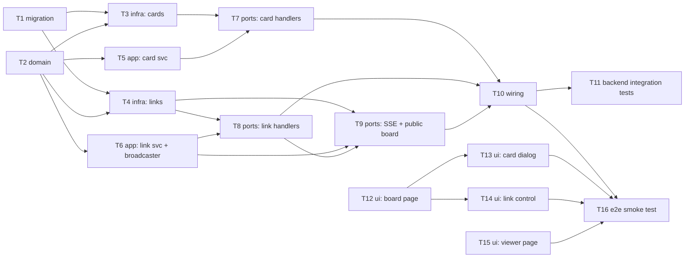

# Epic — tasks

> **Spec:** [spec.md](../spec.md) · **Design:** [sad.md](../sad.md) · **Data model:** [data-model.md](../data-model.md) · **API:** [openapi.yaml](../contracts/openapi.yaml) · **Screens:** [screens.md](../screens.md) · **ADRs:** [adr/](../adr/)

## Goal

Ship the shared kanban board: a team of 3–7 edits cards across three fixed columns from any device with no login, and can generate or disable an unpredictable public link that lets anyone holding it watch the board live, read-only (spec §2 Goals).

## Scope

- **In:** a new `tasks` Go module (domain/app/infra/ports), two Postgres tables, an HTTP + SSE contract, and two web-frontend surfaces (the team editor, the public viewer) reusing the repo's existing shadcn component set.
- **Out (spec §3):** sprints/estimates, accounts/login for editing, column CRUD, manual in-column card ordering, editing by the public-link viewer.

## Task map

## Tasks

See [tracker.md](./tracker.md) for status. Machine contract: [tasks.json](../tasks.json).

| # | Task | Layer | Blocked by | DoD (short) |
|---|---|---|---|---|
| T1 | Promote staged cards + public_links migrations | migration | — | promoted migration applies + reverts cleanly |
| T2 | Card + PublicLink domain entities and sentinel errors | domain | — | unit tests cover name-required + length sentinels |
| T3 | PostgresCardRepository (CRUD + move) | infra | T1, T2 | integration tests cover create/list/update/move/delete |
| T4 | PostgresPublicLinkRepository | infra | T1, T2 | integration tests cover generate/resolve/disable |
| T5 | Card service | app | T2 | unit tests cover last-write-wins + delete-wins-over-move |
| T6 | PublicLink service + broadcaster | app | T2 | unit tests cover generate-replaces-active + fan-out |
| T7 | Card HTTP handlers | ports | T3, T5 | handler tests match openapi.yaml for every card AC |
| T8 | Public-link HTTP handlers | ports | T4, T6 | handler tests match openapi.yaml for link ACs |
| T9 | SSE handlers + public board resolve | ports | T4, T6, T8 | AC-05 byte-identical not-found; SSE delivery test |
| T10 | Wire the tasks module | wiring | T7, T8, T9 | routes reachable, SSE timeout exemption in place |
| T11 | Backend integration tests: concurrency | tests | T10 | AC-07 + AC-15 races proven against real Postgres |
| T12 | SCR-01 Board page | ui | — | loading/empty/default/error + drag component tests |
| T13 | SCR-01 Add/edit card dialog | ui | T12 | add/edit + validation component tests |
| T14 | SCR-01 Public-link control | ui | T12 | none/active/generating/disabling component tests |
| T15 | SCR-02/03 Public viewer page | ui | — | viewer states + not-found-reuse component tests |
| T16 | End-to-end smoke test | tests | T10, T13, T14, T15 | full lifecycle across two browser contexts |

## Risks / Hard rules

- **No auth middleware on any `tasks` route** (spec §3 Non-goals, sad.md §8) — T10 must not wrap these routes in `authmw.Middleware`.
- **The public-board not-found response must be byte-identical to the app's generic 404** (AC-05, ADR-0003) — T9 uses the shared `common.not_found` code, never a `tasks.*` code, for this path.
- **Every card write is an unconditional overwrite** (ADR-0002) — T5/T7 must never add a version check or a 409-on-conflict branch; that would silently violate AC-07/AC-15.
- **The SSE broadcaster is in-process, single-instance only** (sad.md §11 accepted debt) — T6/T10 must not assume it works across multiple `api` replicas.
