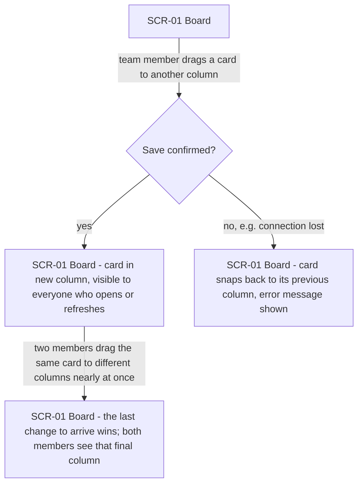
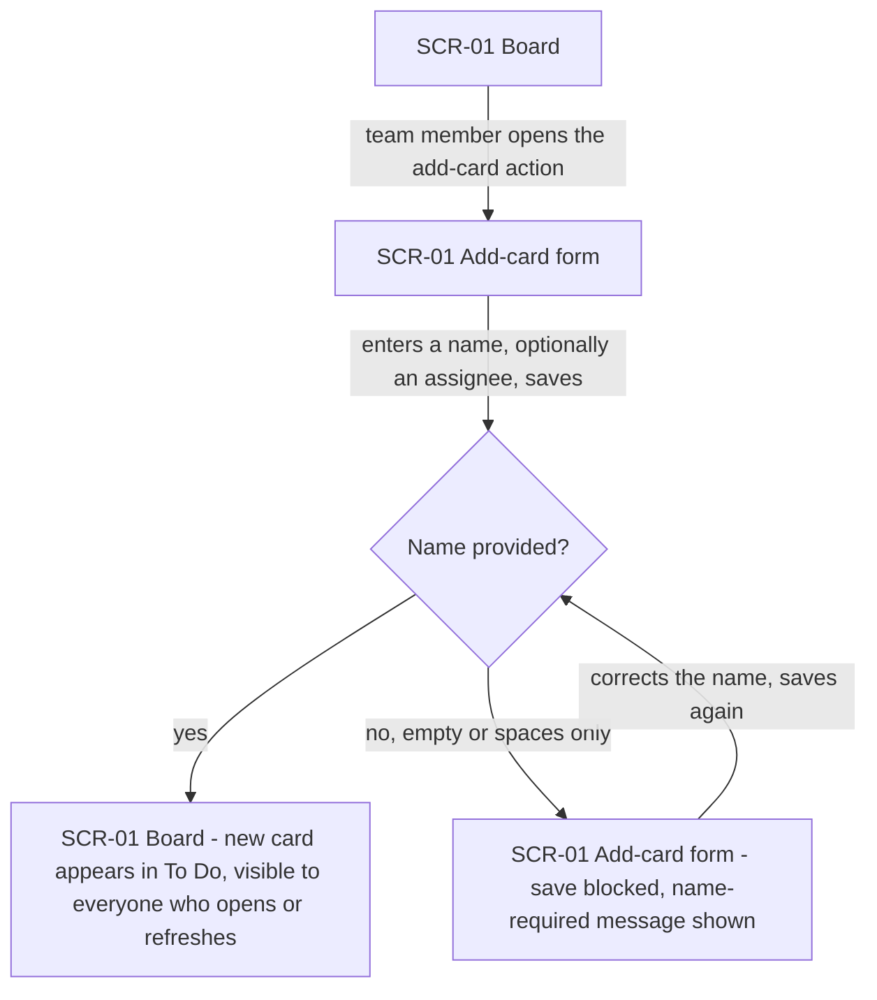
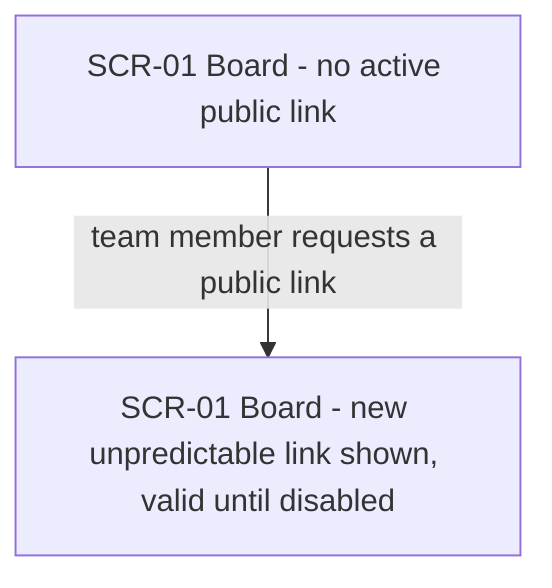
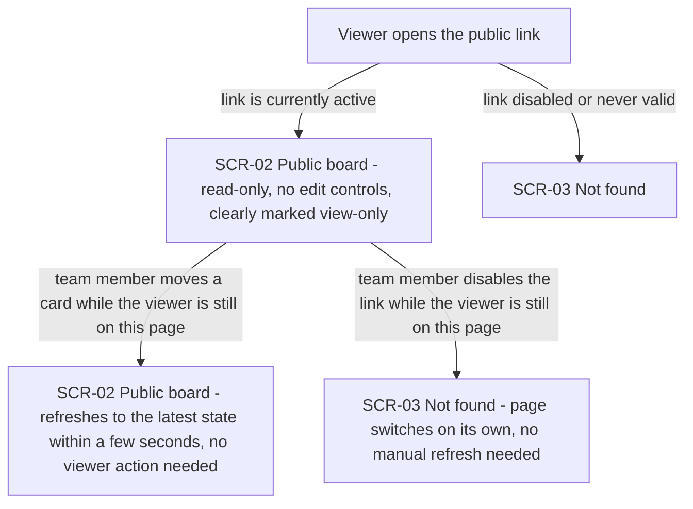
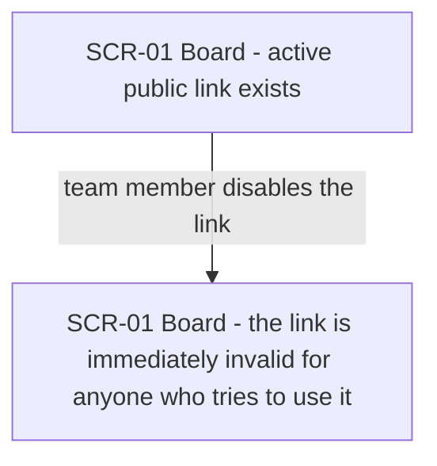
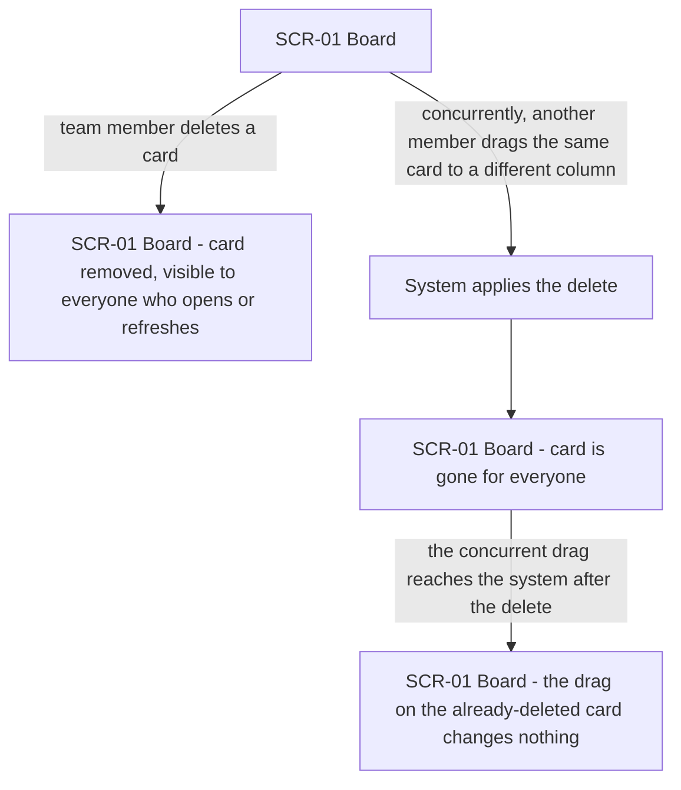
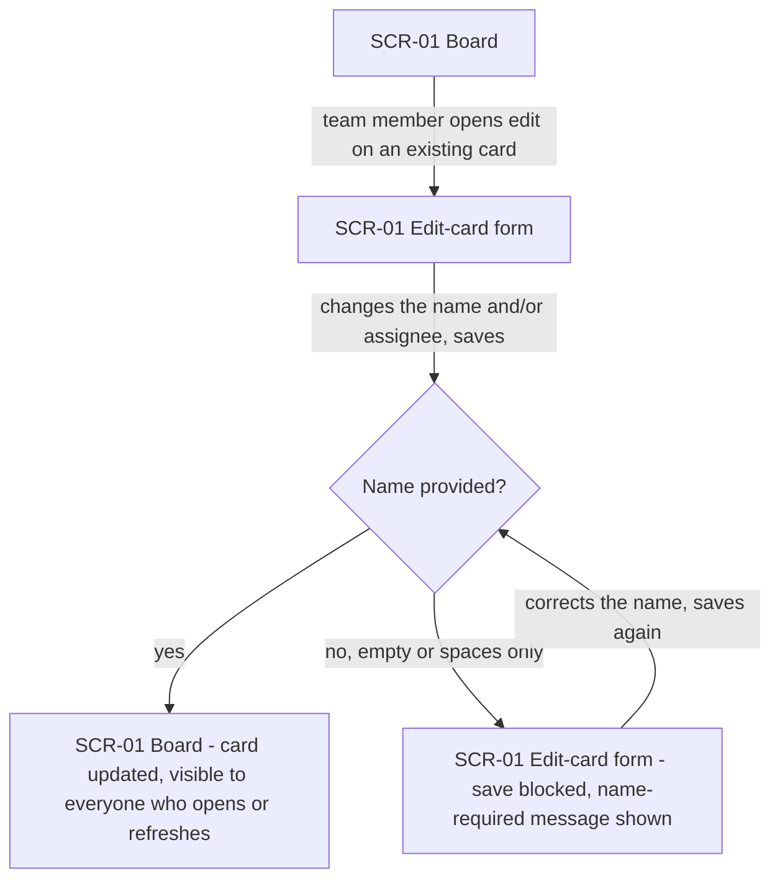

# UX flows — tasks

> User flows for every UI-touching §4 user story, produced by `ux-flows` (after `clarify`, before
> `design`) and read by `design` (evidence for the target-surface + UI-architecture decisions),
> `sequences` (UI-driven flows align on SCR ids), `screens` (details every inventory row) and
> `plan-tests` (the e2e-through-UI paths). **Always markdown + mermaid `flowchart`**, whatever the
> design tool — this artifact is flow-altitude, not visual design.

## Platform decisions

- **Posture:** mobile-first — `docs/design-system.md` does not exist yet in this repo, so there is
  no established default; this is the first decision of this kind for the project. Chosen because
  §6 NFR explicitly requires card drag-and-drop to work by touch on mobile as well as by mouse on
  desktop, and workshop viewers open the public link from their phones in the room. The desktop
  editor and desktop viewer are treated as a scaled-up version of the same interface, not a
  separate design.
- Editing (drag, add/edit/delete card, get/disable public link) and viewing (open public link) are
  two distinct interaction surfaces on the same board data — no navigation between them for the
  same person; a team member and a viewer are always on separate devices/sessions.
- Add-card and edit-card are treated as in-place states of the board screen (SCR-01), not separate
  screens — neither navigates away from the board.

## Screen inventory

| ID | Screen | Purpose | Entry | Exit |
|---|---|---|---|---|
| SCR-01 | Board (editor) | Team member views and edits the shared board — drag cards, add/edit/delete a card, get or disable the public link | Opens the app URL | Stays open (persistent); no forward navigation |
| SCR-02 | Public board (viewer) | Viewer sees the board's current state, read-only | Opens the public link while it is active | Link disabled while viewing → SCR-03; closes tab |
| SCR-03 | Not found (viewer) | Shown for a disabled or never-valid public link, indistinguishable from any other non-existent address | Invalid/disabled link opened directly, or link disabled while SCR-02 is open | Dead end — no further navigation |

## Flows

### Flow: US-01 — Перетягнути картку в іншу колонку

Учасник команди перетягує картку в іншу колонку на SCR-01; коли система підтверджує зміну, картка лишається в новій колонці і цю зміну бачить кожен, хто відкриє чи оновить борду (AC-01). Якщо підтвердження не приходить, наприклад через втрату з'єднання, картка візуально повертається на попереднє місце і учасник бачить повідомлення про помилку збереження (AC-11). Якщо двоє учасників майже одночасно перетягують ту саму картку в різні колонки, перемагає та зміна, що дійшла до системи останньою, і саме її бачать обидва учасники при наступному погляді на борду (AC-07).

### Flow: US-02 — Додати нову картку

Учасник команди відкриває форму додавання картки на SCR-01, вводить назву й, за бажанням, ім'я виконавця; після збереження картка з'являється в колонці To Do і її бачить кожен, хто відкриє чи оновить борду (AC-02). Якщо учасник намагається зберегти картку без назви (порожнє поле або лише пробіли), система блокує збереження і повідомляє, що назва обов'язкова, лишаючи форму відкритою для виправлення (AC-03).

### Flow: US-03 — Отримати публічний лінк

Учасник команди, коли активного публічного лінка ще немає (борда щойно розгорнута або попередній лінк вимкнено), запитує публічне посилання; система одразу генерує нове непередбачуване посилання, показує його учаснику, і воно лишається дійсним, доки його не вимкнено (AC-09).

### Flow: US-04 — Переглянути борду за лінком

Глядач відкриває публічний лінк; якщо лінк чинний, бачить борду лише в режимі перегляду, без жодних елементів редагування, і борда чітко позначена як view-only (AC-06). Якщо команда щойно перенесла картку, глядач при відкритті лінка бачить саме цей щойно оновлений стан, а не застарілий знімок (AC-08); поки сторінка глядача лишається відкритою, вона підхоплює подальші зміни команди сама, без ручного оновлення, у межах кількох секунд. Якщо лінк вимкнено ще до того, як глядач ним скористався, або посилання ніколи не було дійсним, глядач бачить "нічого не знайдено" — так само, як для будь-якої неіснуючої адреси, без підтвердження, що борда колись була тут доступна (AC-05). Якщо ж команда вимикає лінк саме тоді, коли глядач уже дивиться борду за ним, сторінка глядача сама протягом короткого часу переходить у стан "нічого не знайдено", без потреби оновлювати сторінку вручну (AC-12).

### Flow: US-05 — Вимкнути публічний лінк

Учасник команди вимикає активний публічний лінк на SCR-01; система негайно перестає визнавати цей лінк дійсним для будь-кого, хто спробує ним скористатись (AC-04) — включно з глядачем, який саме в цей момент дивиться борду за ним (продовження в гілці Flow US-04, AC-12).

### Flow: US-06 — Видалити картку

Учасник команди видаляє неактуальну картку; вона зникає з борди для всіх, хто відкриє чи оновить борду (AC-10). Якщо в цей самий момент інший учасник перетягує ту саму картку в іншу колонку, видалення перемагає: картка зникає для всіх, а подальша спроба перетягнути вже видалену картку нічого на борді не змінює (AC-15).

### Flow: US-07 — Редагувати картку

Учасник команди відкриває наявну картку на редагування, змінює назву і/або ім'я виконавця та зберігає; зміна стає видимою для всіх, хто відкриє чи оновить борду (AC-13). Якщо учасник намагається зберегти картку без назви (порожнє поле або лише пробіли), система блокує збереження і повідомляє, що назва обов'язкова, лишаючи форму відкритою для виправлення (AC-14).

## AC coverage

| AC | Shown by | Notes |
|---|---|---|
| AC-01 | Flow US-01 → happy branch (B→C) | Move confirmed, visible to all |
| AC-02 | Flow US-02 → happy branch (C→D) | New card lands in To Do |
| AC-03 | Flow US-02 → error branch (C→E) | Empty/whitespace name blocked |
| AC-04 | Flow US-05 → A→B | Link disabled, invalid immediately |
| AC-05 | Flow US-04 → A→C | Disabled/never-valid link → not found, no confirmation it ever existed |
| AC-06 | Flow US-04 → A→B | Public board is read-only, no edit controls, marked view-only |
| AC-07 | Flow US-01 → C→E | Concurrent drag on same card, last-arrived wins |
| AC-08 | Flow US-04 → A→B | Viewer sees the team's just-made change, not a stale snapshot |
| AC-09 | Flow US-03 → A→B | New unpredictable link generated |
| AC-10 | Flow US-06 → A→B | Card removed, visible to all |
| AC-11 | Flow US-01 → B→D | Save failure → card snaps back, error shown |
| AC-12 | Flow US-04 → B→E | Link disabled while viewer's page is open → auto-transitions to not-found |
| AC-13 | Flow US-07 → C→D | Card updated, visible to all |
| AC-14 | Flow US-07 → C→E | Empty/whitespace name blocked |
| AC-15 | Flow US-06 → C→D→E | Delete wins over a concurrent drag on the same card |
