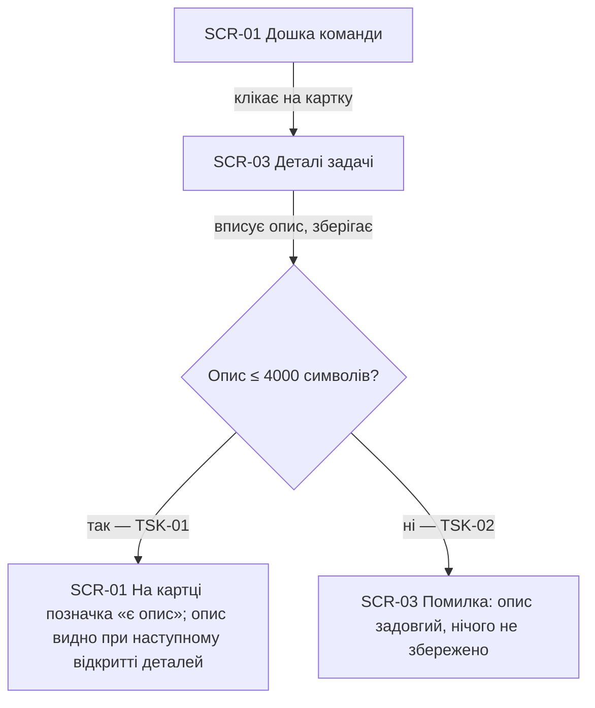
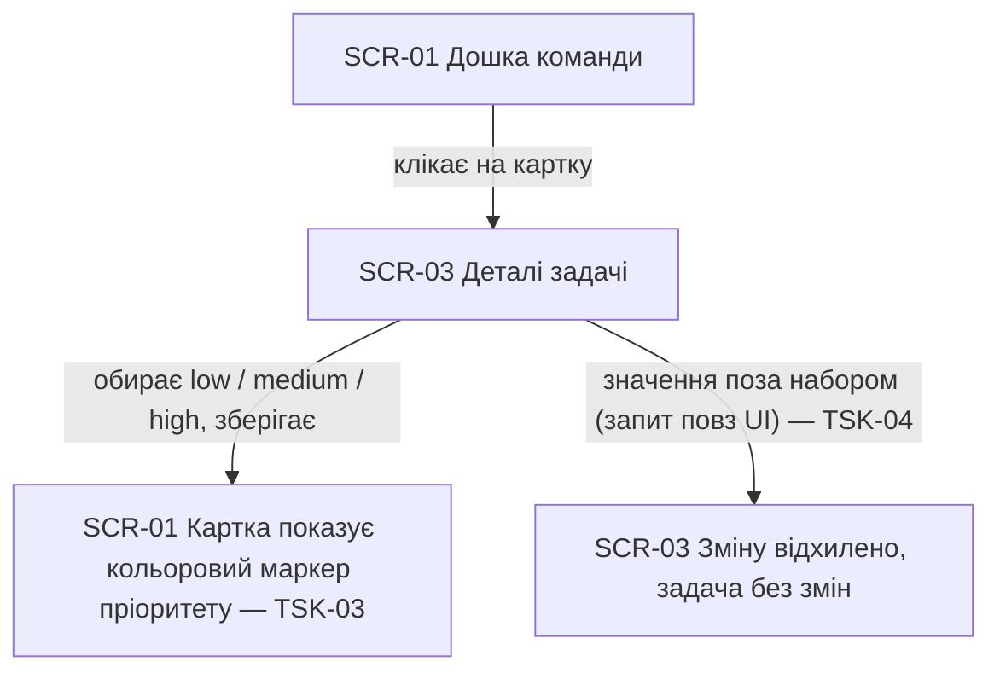
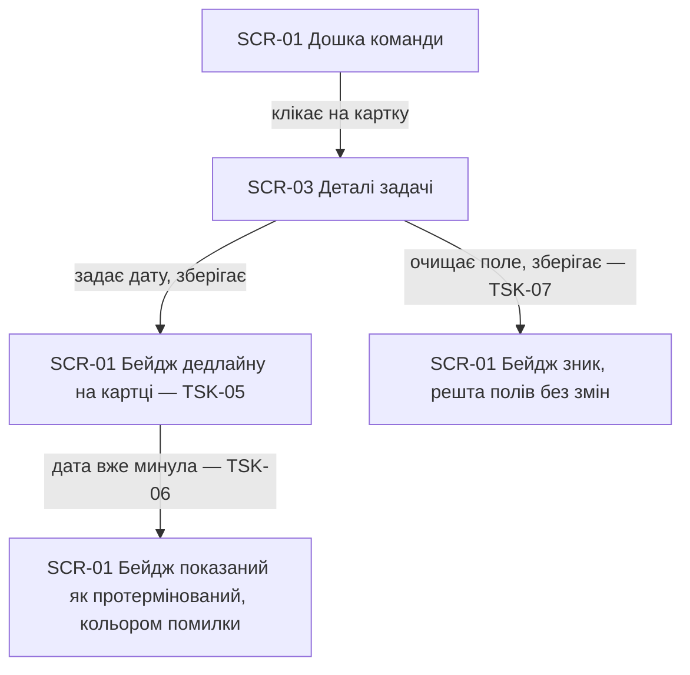
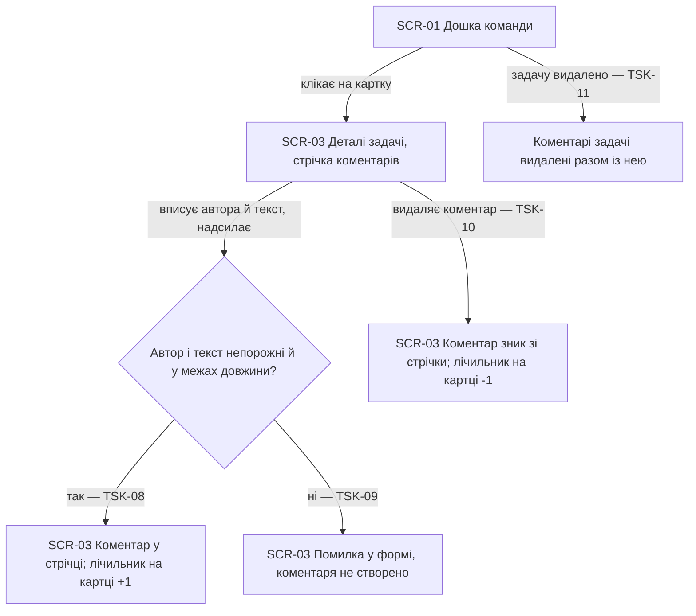
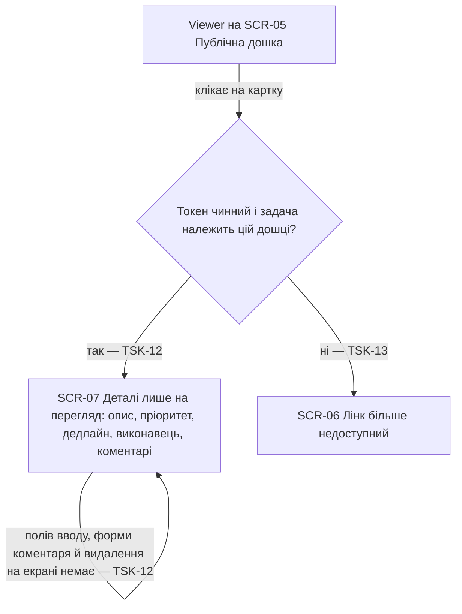
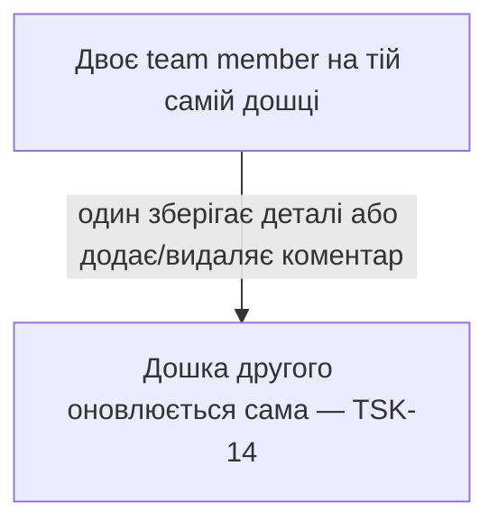

# UX flows — tasks

> Флоу для кожної UI-дотичної user story §4. Успадковує інвентар екранів фічі board
> (`docs/features/board/ux-flows.md`): SCR-01 і SCR-05 лишаються тими самими екранами,
> SCR-03 **розширюється** з форми редагування до повних деталей задачі, і додається
> SCR-07 — те саме, але для глядача.

## Platform decisions

- **Постава** — mobile-first, як у фічі board: детальна модалка має читатись на телефоні
  глядача на воркшопі так само, як на ноутбуці редактора.
- **Деталі задачі — це той самий екран, що й редагування** (SCR-03), а не новий: клік по
  картці вже відкривав модалку з назвою й виконавцем, і додавання опису/пріоритету/
  дедлайну/коментарів не додає нового переходу. Зайвий екран «спершу перегляд, потім
  редагування» лише подвоїв би кліки.
- **Коментарі — всередині тієї самої модалки**, під полями задачі: обговорення без
  контексту задачі не має сенсу, а окрема панель коментарів на мобільному з'їла б увесь
  екран.
- **Картка не показує ані опису, ані тексту коментарів** — лише маркери: колір пріоритету,
  бейдж дедлайну, значок «є опис», лічильник коментарів. Колонка мусить лишитись
  скануванням за пів секунди (spec §2).
- **Глядач клікає картку так само, як редактор** (SCR-05 → SCR-07): раніше картка в
  read-only була неклікабельна, бо за нею нічого не було; тепер за нею є деталі. Це не
  порушує AC-10 фічі board — SCR-07 не має жодного поля вводу.
- **Видалення коментаря — дія в стрічці коментаря** (як видалення задачі живе в самій
  формі, board ux-flows), без окремого екрана підтвердження.

## Screen inventory

| ID | Screen | Purpose | Entry | Exit |
|---|---|---|---|---|
| SCR-01 | Дошка команди (editor view) | Без змін проти board, крім маркерів на картках: пріоритет, дедлайн, «є опис», лічильник коментарів | Дефолтна сторінка дошки | SCR-03 (клік по картці) |
| SCR-03 | Деталі задачі (editor) | **Розширений**: назва, опис, пріоритет, дедлайн, виконавець; нижче — стрічка коментарів і форма додавання; збереження і видалення задачі | Клік по картці на SCR-01 | Назад на SCR-01 (збережено / видалено / скасовано) |
| SCR-05 | Публічна дошка (viewer view) | Без змін проти board, крім тих самих маркерів на картках | Відкриття URL публічного лінка | SCR-07 (клік по картці) |
| SCR-07 | Деталі задачі (viewer, read-only) | Опис, пріоритет, дедлайн, виконавець і стрічка коментарів — лише текст, без полів, форми й видалення | Клік по картці на SCR-05 | Назад на SCR-05 (закриття) |
| SCR-06 | Лінк недоступний | Без змін проти board — сюди ж веде спроба відкрити деталі за мертвим або чужим токеном (TSK-13) | Мертвий/чужий токен | Немає (глухий кут) |

## Flows

### Flow: US-01 — Описати задачу

Team member клікає картку й потрапляє в деталі задачі. Він вписує опис і зберігає: якщо
опис вміщається в 4000 символів (TSK-01), система зберігає його, а на картці зʼявляється
значок «є опис» — сам текст на картці не показується. Якщо опис довший (TSK-02), система
блокує збереження просто у формі й не змінює жодного поля задачі.

### Flow: US-02 — Позначити пріоритет

Team member обирає пріоритет зі списку з трьох значень і зберігає — картка одразу показує
кольоровий маркер (TSK-03). Задача, створена без явного вибору, лишається на medium. Набір
значень закритий: значення поза ним (яке в UI обрати неможливо, але можна надіслати
запитом) система відхиляє, не змінюючи задачу (TSK-04).

### Flow: US-03 — Поставити дедлайн

Team member задає задачі дату — картка показує її бейджем (TSK-05). Якщо дата вже минула,
той самий бейдж показаний кольором помилки, щоб протермінована робота не губилась серед
решти карток (TSK-06). Очищення поля знімає дедлайн: бейдж зникає, решта полів лишається
незмінною (TSK-07).

### Flow: US-04 — Обговорити задачу в коментарях

У деталях задачі team member бачить стрічку коментарів — найстаріші зверху — і форму
додавання, у якій поле автора вже заповнене його імʼям (його можна виправити: це вільний
текст, а не акаунт). Непорожній коментар у межах довжини потрапляє у стрічку, а лічильник
на картці зростає (TSK-08); порожній чи задовгий — блокується у формі (TSK-09). Видалення
коментаря прибирає його зі стрічки для всіх (TSK-10). Якщо видалити саму задачу, її
коментарі зникають разом із нею (TSK-11).

### Flow: US-05 — Деталі задачі за публічним лінком

Viewer клікає картку на публічній дошці й бачить ті самі деталі, що й редактор, але лише
як текст: полів, форми коментаря й кнопок видалення на екрані просто немає (TSK-12). Якщо
токен уже відкликано або задача належить іншій дошці, система не показує нічого й веде на
той самий чесний екран «лінк більше недоступний», що й мертвий лінк (TSK-13).

### Flow: TSK-14 — Live-оновлення деталей

Зміна деталей задачі й будь-яка дія з коментарем — така сама зміна стану дошки, як
створення чи переміщення задачі: вона транслюється тим самим каналом, і відкриті дошки
(редакторські й глядацькі) оновлюються без перезавантаження.

## AC coverage

| AC | Shown by | Notes |
|---|---|---|
| TSK-01 | Flow US-01 → C (так) → D | happy: опис збережено, маркер на картці |
| TSK-02 | Flow US-01 → C (ні) → E | error: задовгий опис заблоковано |
| TSK-03 | Flow US-02 → C | happy: маркер пріоритету, default medium |
| TSK-04 | Flow US-02 → D | domain invariant: закритий набір значень |
| TSK-05 | Flow US-03 → C | happy: бейдж дедлайну |
| TSK-06 | Flow US-03 → C → D | стан: протермінований бейдж |
| TSK-07 | Flow US-03 → E | happy: зняття дедлайну |
| TSK-08 | Flow US-04 → C (так) → D | happy: коментар у стрічці, лічильник |
| TSK-09 | Flow US-04 → C (ні) → E | error: валідація коментаря |
| TSK-10 | Flow US-04 → F | happy: видалення коментаря |
| TSK-11 | Flow US-04 → G | data invariant: каскад із задачею |
| TSK-12 | Flow US-05 → B (так) → C | authorization: viewer read-only |
| TSK-13 | Flow US-05 → B (ні) → D | cross-context: чужий/мертвий токен |
| TSK-14 | Flow TSK-14 | live: той самий канал стану дошки |
